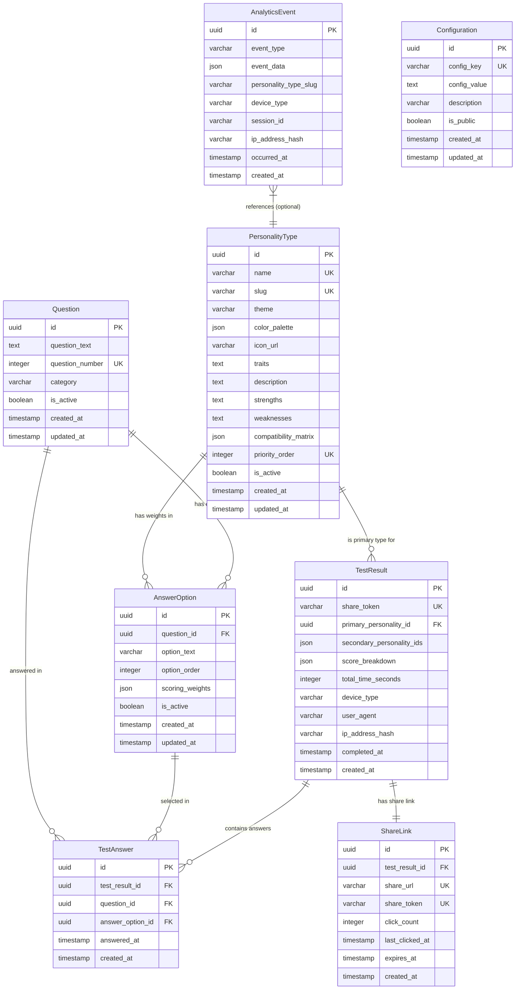

# Data Model

## Document Information
- **Project**: ChickPersonality
- **Based on**: Project Spec Description (Step 1), User Stories (Step 2), Use Cases (Step 3)
- **Version**: 1.0
- **Last Updated**: 2026-05-26

---

## 1. Entity List

### Entity: PersonalityType
**Description**: Represents one of the 7 chick personality archetypes with unique themes, traits, and visual characteristics.

**Key Attributes:**
- `id` (UUID, Primary Key) - Unique identifier for the personality type
- `name` (VARCHAR(100), Not Null, Unique) - Name of the personality type (e.g., "The Bold Explorer")
- `slug` (VARCHAR(50), Not Null, Unique) - URL-friendly identifier (e.g., "bold-explorer")
- `theme` (VARCHAR(100), Not Null) - Core theme description (e.g., "Adventure, curiosity, spontaneity")
- `color_palette` (JSON, Not Null) - Color scheme definition (primary, secondary, accent colors)
- `icon_url` (VARCHAR(500), Nullable) - URL to icon or illustration
- `traits` (TEXT, Not Null) - Comma-separated list of key traits
- `description` (TEXT, Not Null) - Detailed personality description
- `strengths` (TEXT, Not Null) - Comma-separated list of strengths with descriptions
- `weaknesses` (TEXT, Not Null) - Comma-separated list of weaknesses with descriptions
- `compatibility_matrix` (JSON, Not Null) - Compatibility scores with other personality types
- `priority_order` (INTEGER, Not Null, Unique) - Tie-breaker priority (1-7)
- `is_active` (BOOLEAN, Not Null, Default: true) - Whether this type is currently active
- `created_at` (TIMESTAMP, Not Null, Default: NOW()) - Creation timestamp
- `updated_at` (TIMESTAMP, Not Null, Default: NOW()) - Last update timestamp

**Business Rules:**
- BR-DM-001: Exactly 7 personality types must be active at any time
- BR-DM-002: Each personality type must have a unique name and slug
- BR-DM-003: Priority order must be unique across all personality types (1-7)
- BR-DM-004: Color palette must include at least primary and secondary colors
- BR-DM-005: Compatibility matrix must include scores for all other personality types

---

### Entity: Question
**Description**: A single question in the personality test with multiple answer options.

**Key Attributes:**
- `id` (UUID, Primary Key) - Unique identifier for the question
- `question_text` (TEXT, Not Null) - The question text
- `question_number` (INTEGER, Not Null, Unique) - Sequential order in the test (1-30)
- `category` (VARCHAR(50), Nullable) - Optional category grouping for questions
- `is_active` (BOOLEAN, Not Null, Default: true) - Whether this question is currently active
- `created_at` (TIMESTAMP, Not Null, Default: NOW()) - Creation timestamp
- `updated_at` (TIMESTAMP, Not Null, Default: NOW()) - Last update timestamp

**Business Rules:**
- BR-DM-006: Question numbers must be sequential and unique (1-30)
- BR-DM-007: At least 20 questions must be active for a valid test
- BR-DM-008: Question text must be clear and concise (max 200 characters recommended)
- BR-DM-009: Questions cannot be deleted if they have associated test results (soft delete only)

---

### Entity: AnswerOption
**Description**: An answer option for a question with scoring weights for each personality type.

**Key Attributes:**
- `id` (UUID, Primary Key) - Unique identifier for the answer option
- `question_id` (UUID, Foreign Key, Not Null) - Reference to the question
- `option_text` (VARCHAR(255), Not Null) - The answer option text
- `option_order` (INTEGER, Not Null) - Display order for this option (1-5)
- `scoring_weights` (JSON, Not Null) - Weight values for each personality type
- `is_active` (BOOLEAN, Not Null, Default: true) - Whether this option is currently active
- `created_at` (TIMESTAMP, Not Null, Default: NOW()) - Creation timestamp
- `updated_at` (TIMESTAMP, Not Null, Default: NOW()) - Last update timestamp

**Business Rules:**
- BR-DM-010: Each question must have 4-5 active answer options
- BR-DM-011: Scoring weights must include values for all active personality types
- BR-DM-012: Weight values must be non-negative integers (0-10 recommended)
- BR-DM-013: Option order must be unique within a question
- BR-DM-014: Scoring weights JSON structure: `{"personality_type_slug": weight_value}`

---

### Entity: TestResult
**Description**: A completed personality test result with calculated scores and primary personality type.

**Key Attributes:**
- `id` (UUID, Primary Key) - Unique identifier for the test result
- `share_token` (VARCHAR(32), Not Null, Unique) - Unique token for sharing results
- `primary_personality_id` (UUID, Foreign Key, Not Null) - Reference to primary personality type
- `secondary_personality_ids` (JSON, Nullable) - Array of secondary personality type IDs
- `score_breakdown` (JSON, Not Null) - Percentage scores for all personality types
- `total_time_seconds` (INTEGER, Not Null) - Time taken to complete the test
- `device_type` (VARCHAR(20), Not Null) - Device type (mobile, tablet, desktop)
- `user_agent` (VARCHAR(500), Nullable) - Browser user agent string
- `ip_address_hash` (VARCHAR(64), Nullable) - Hashed IP address for analytics
- `completed_at` (TIMESTAMP, Not Null, Default: NOW()) - Completion timestamp
- `created_at` (TIMESTAMP, Not Null, Default: NOW()) - Creation timestamp

**Business Rules:**
- BR-DM-015: Share token must be unique and cryptographically random
- BR-DM-016: Score breakdown must include percentages for all 7 personality types
- BR-DM-017: Percentages in score breakdown must sum to 100% (within 1% tolerance)
- BR-DM-018: IP address must be hashed before storage (SHA-256)
- BR-DM-019: Test results are retained for 90 days, then archived or deleted

---

### Entity: TestAnswer
**Description**: Individual answer selections for a test result, tracking which option was selected for each question.

**Key Attributes:**
- `id` (UUID, Primary Key) - Unique identifier for the test answer
- `test_result_id` (UUID, Foreign Key, Not Null) - Reference to the test result
- `question_id` (UUID, Foreign Key, Not Null) - Reference to the question
- `answer_option_id` (UUID, Foreign Key, Not Null) - Reference to the selected answer option
- `answered_at` (TIMESTAMP, Not Null, Default: NOW()) - Timestamp when answer was recorded
- `created_at` (TIMESTAMP, Not Null, Default: NOW()) - Creation timestamp

**Business Rules:**
- BR-DM-020: Each test result must have exactly one answer per active question
- BR-DM-021: A question cannot have multiple answers for the same test result
- BR-DM-022: Answer options must belong to the referenced question

---

### Entity: ShareLink
**Description**: Unique shareable links for test results with expiration and access tracking.

**Key Attributes:**
- `id` (UUID, Primary Key) - Unique identifier for the share link
- `test_result_id` (UUID, Foreign Key, Not Null) - Reference to the test result
- `share_url` (VARCHAR(500), Not Null, Unique) - Full shareable URL
- `share_token` (VARCHAR(32), Not Null, Unique) - Token from test_result (redundant for indexing)
- `click_count` (INTEGER, Not Null, Default: 0) - Number of times the link was clicked
- `last_clicked_at` (TIMESTAMP, Nullable) - Last click timestamp
- `expires_at` (TIMESTAMP, Not Null) - Expiration date for the link
- `created_at` (TIMESTAMP, Not Null, Default: NOW()) - Creation timestamp

**Business Rules:**
- BR-DM-023: Share links expire 30 days after creation
- BR-DM-024: Share URL must be unique and include the share token
- BR-DM-025: Click count is incremented each time the link is accessed
- BR-DM-026: Expired links should redirect to landing page with message

---

### Entity: AnalyticsEvent
**Description**: Anonymized analytics events for tracking user behavior and app performance.

**Key Attributes:**
- `id` (UUID, Primary Key) - Unique identifier for the analytics event
- `event_type` (VARCHAR(50), Not Null) - Type of event (test_started, test_completed, share_clicked, etc.)
- `event_data` (JSON, Nullable) - Additional event-specific data
- `personality_type_slug` (VARCHAR(50), Nullable) - Personality type if applicable
- `device_type` (VARCHAR(20), Nullable) - Device type (mobile, tablet, desktop)
- `session_id` (VARCHAR(64), Nullable) - Anonymous session identifier
- `ip_address_hash` (VARCHAR(64), Nullable) - Hashed IP address
- `occurred_at` (TIMESTAMP, Not Null, Default: NOW()) - Event timestamp
- `created_at` (TIMESTAMP, Not Null, Default: NOW()) - Creation timestamp

**Business Rules:**
- BR-DM-027: All analytics events must be anonymized (no PII)
- BR-DM-028: Session ID must be a random UUID, not linked to user identity
- BR-DM-029: IP addresses must be hashed before storage
- BR-DM-030: Analytics data is retained for 1 year, then aggregated or deleted
- BR-DM-031: Event types must be from a predefined list

---

### Entity: Configuration
**Description**: Application configuration settings for test behavior, scoring, and features.

**Key Attributes:**
- `id` (UUID, Primary Key) - Unique identifier for the configuration
- `config_key` (VARCHAR(100), Not Null, Unique) - Configuration key name
- `config_value` (TEXT, Not Null) - Configuration value (can be JSON string)
- `description` (VARCHAR(500), Nullable) - Description of the configuration
- `is_public` (BOOLEAN, Not Null, Default: false) - Whether this config is exposed to frontend
- `created_at` (TIMESTAMP, Not Null, Default: NOW()) - Creation timestamp
- `updated_at` (TIMESTAMP, Not Null, Default: NOW()) - Last update timestamp

**Business Rules:**
- BR-DM-032: Configuration keys must be unique
- BR-DM-033: Public configurations can be accessed by frontend without authentication
- BR-DM-034: Sensitive configurations (API keys, secrets) must never be public
- BR-DM-035: Configuration changes should be logged for audit

---

## 2. Relationships

### Relationship 1: PersonalityType ← TestResult
**Type**: 1:N (One-to-Many)
**Cardinality**: PersonalityType (1, Mandatory) → TestResult (0 or N, Optional)
**Description**: A personality type can be the primary type for many test results. Each test result has exactly one primary personality type.
**Cascade Behavior**: ON DELETE RESTRICT (cannot delete personality type with test results)

---

### Relationship 2: Question ← AnswerOption
**Type**: 1:N (One-to-Many)
**Cardinality**: Question (1, Mandatory) → AnswerOption (0 or N, Optional)
**Description**: A question can have many answer options. Each answer option belongs to exactly one question.
**Cascade Behavior**: ON DELETE CASCADE (deleting a question deletes its answer options)

---

### Relationship 3: TestResult ← TestAnswer
**Type**: 1:N (One-to-Many)
**Cardinality**: TestResult (1, Mandatory) → TestAnswer (0 or N, Optional)
**Description**: A test result can have many test answers (one per question). Each test answer belongs to exactly one test result.
**Cascade Behavior**: ON DELETE CASCADE (deleting a test result deletes its answers)

---

### Relationship 4: Question ← TestAnswer
**Type**: 1:N (One-to-Many)
**Cardinality**: Question (1, Mandatory) → TestAnswer (0 or N, Optional)
**Description**: A question can be answered in many test results. Each test answer references exactly one question.
**Cascade Behavior**: ON DELETE RESTRICT (cannot delete question with test answers)

---

### Relationship 5: AnswerOption ← TestAnswer
**Type**: 1:N (One-to-Many)
**Cardinality**: AnswerOption (1, Mandatory) → TestAnswer (0 or N, Optional)
**Description**: An answer option can be selected in many test results. Each test answer references exactly one answer option.
**Cascade Behavior**: ON DELETE RESTRICT (cannot delete answer option with test answers)

---

### Relationship 6: TestResult ← ShareLink
**Type**: 1:1 (One-to-One)
**Cardinality**: TestResult (1, Mandatory) → ShareLink (0 or 1, Optional)
**Description**: A test result can have one share link. Each share link belongs to exactly one test result.
**Cascade Behavior**: ON DELETE CASCADE (deleting a test result deletes its share link)

---

### Relationship 7: PersonalityType ← AnswerOption (via scoring_weights)
**Type**: M:N (Many-to-Many, implicit)
**Cardinality**: PersonalityType (0 or N) ↔ AnswerOption (0 or N)
**Description**: Answer options have scoring weights for multiple personality types. This is implemented through the JSON scoring_weights field in AnswerOption, not a separate junction table.
**Cascade Behavior**: N/A (implemented via JSON field)

---

## 3. Entity-Relationship Diagram

---

## 4. Data Dictionary

| Entity | Attribute | Type | Constraints | Description |
|--------|-----------|------|-------------|-------------|
| PersonalityType | id | UUID | PK, Not Null | Unique identifier |
| PersonalityType | name | VARCHAR(100) | Not Null, Unique | Name of personality type |
| PersonalityType | slug | VARCHAR(50) | Not Null, Unique | URL-friendly identifier |
| PersonalityType | theme | VARCHAR(100) | Not Null | Core theme description |
| PersonalityType | color_palette | JSON | Not Null | Color scheme definition |
| PersonalityType | icon_url | VARCHAR(500) | Nullable | URL to icon/illustration |
| PersonalityType | traits | TEXT | Not Null | Comma-separated traits |
| PersonalityType | description | TEXT | Not Null | Detailed description |
| PersonalityType | strengths | TEXT | Not Null | Comma-separated strengths |
| PersonalityType | weaknesses | TEXT | Not Null | Comma-separated weaknesses |
| PersonalityType | compatibility_matrix | JSON | Not Null | Compatibility scores |
| PersonalityType | priority_order | INTEGER | Not Null, Unique | Tie-breaker priority (1-7) |
| PersonalityType | is_active | BOOLEAN | Not Null, Default: true | Active status |
| PersonalityType | created_at | TIMESTAMP | Not Null, Default: NOW() | Creation timestamp |
| PersonalityType | updated_at | TIMESTAMP | Not Null, Default: NOW() | Update timestamp |
| Question | id | UUID | PK, Not Null | Unique identifier |
| Question | question_text | TEXT | Not Null | Question text |
| Question | question_number | INTEGER | Not Null, Unique | Sequential order (1-30) |
| Question | category | VARCHAR(50) | Nullable | Optional category |
| Question | is_active | BOOLEAN | Not Null, Default: true | Active status |
| Question | created_at | TIMESTAMP | Not Null, Default: NOW() | Creation timestamp |
| Question | updated_at | TIMESTAMP | Not Null, Default: NOW() | Update timestamp |
| AnswerOption | id | UUID | PK, Not Null | Unique identifier |
| AnswerOption | question_id | UUID | FK, Not Null | Reference to Question |
| AnswerOption | option_text | VARCHAR(255) | Not Null | Answer option text |
| AnswerOption | option_order | INTEGER | Not Null | Display order (1-5) |
| AnswerOption | scoring_weights | JSON | Not Null | Weight values per personality type |
| AnswerOption | is_active | BOOLEAN | Not Null, Default: true | Active status |
| AnswerOption | created_at | TIMESTAMP | Not Null, Default: NOW() | Creation timestamp |
| AnswerOption | updated_at | TIMESTAMP | Not Null, Default: NOW() | Update timestamp |
| TestResult | id | UUID | PK, Not Null | Unique identifier |
| TestResult | share_token | VARCHAR(32) | Not Null, Unique | Share token |
| TestResult | primary_personality_id | UUID | FK, Not Null | Reference to PersonalityType |
| TestResult | secondary_personality_ids | JSON | Nullable | Secondary type IDs |
| TestResult | score_breakdown | JSON | Not Null | Percentage scores |
| TestResult | total_time_seconds | INTEGER | Not Null | Completion time |
| TestResult | device_type | VARCHAR(20) | Not Null | Device type |
| TestResult | user_agent | VARCHAR(500) | Nullable | Browser user agent |
| TestResult | ip_address_hash | VARCHAR(64) | Nullable | Hashed IP address |
| TestResult | completed_at | TIMESTAMP | Not Null | Completion timestamp |
| TestResult | created_at | TIMESTAMP | Not Null, Default: NOW() | Creation timestamp |
| TestAnswer | id | UUID | PK, Not Null | Unique identifier |
| TestAnswer | test_result_id | UUID | FK, Not Null | Reference to TestResult |
| TestAnswer | question_id | UUID | FK, Not Null | Reference to Question |
| TestAnswer | answer_option_id | UUID | FK, Not Null | Reference to AnswerOption |
| TestAnswer | answered_at | TIMESTAMP | Not Null, Default: NOW() | Answer timestamp |
| TestAnswer | created_at | TIMESTAMP | Not Null, Default: NOW() | Creation timestamp |
| ShareLink | id | UUID | PK, Not Null | Unique identifier |
| ShareLink | test_result_id | UUID | FK, Not Null, Unique | Reference to TestResult |
| ShareLink | share_url | VARCHAR(500) | Not Null, Unique | Full shareable URL |
| ShareLink | share_token | VARCHAR(32) | Not Null, Unique | Share token |
| ShareLink | click_count | INTEGER | Not Null, Default: 0 | Click count |
| ShareLink | last_clicked_at | TIMESTAMP | Nullable | Last click timestamp |
| ShareLink | expires_at | TIMESTAMP | Not Null | Expiration date |
| ShareLink | created_at | TIMESTAMP | Not Null, Default: NOW() | Creation timestamp |
| AnalyticsEvent | id | UUID | PK, Not Null | Unique identifier |
| AnalyticsEvent | event_type | VARCHAR(50) | Not Null | Event type |
| AnalyticsEvent | event_data | JSON | Nullable | Event-specific data |
| AnalyticsEvent | personality_type_slug | VARCHAR(50) | Nullable | Personality type reference |
| AnalyticsEvent | device_type | VARCHAR(20) | Nullable | Device type |
| AnalyticsEvent | session_id | VARCHAR(64) | Nullable | Session identifier |
| AnalyticsEvent | ip_address_hash | VARCHAR(64) | Nullable | Hashed IP address |
| AnalyticsEvent | occurred_at | TIMESTAMP | Not Null, Default: NOW() | Event timestamp |
| AnalyticsEvent | created_at | TIMESTAMP | Not Null, Default: NOW() | Creation timestamp |
| Configuration | id | UUID | PK, Not Null | Unique identifier |
| Configuration | config_key | VARCHAR(100) | Not Null, Unique | Configuration key |
| Configuration | config_value | TEXT | Not Null | Configuration value |
| Configuration | description | VARCHAR(500) | Nullable | Description |
| Configuration | is_public | BOOLEAN | Not Null, Default: false | Public flag |
| Configuration | created_at | TIMESTAMP | Not Null, Default: NOW() | Creation timestamp |
| Configuration | updated_at | TIMESTAMP | Not Null, Default: NOW() | Update timestamp |

---

## 5. Integrity Constraints

### Primary Key Constraints
- **PersonalityType.id**: UNIQUE, NOT NULL
- **Question.id**: UNIQUE, NOT NULL
- **AnswerOption.id**: UNIQUE, NOT NULL
- **TestResult.id**: UNIQUE, NOT NULL
- **TestAnswer.id**: UNIQUE, NOT NULL
- **ShareLink.id**: UNIQUE, NOT NULL
- **AnalyticsEvent.id**: UNIQUE, NOT NULL
- **Configuration.id**: UNIQUE, NOT NULL

### Foreign Key Constraints
- **AnswerOption.question_id** → Question.id
  - ON DELETE CASCADE
  - ON UPDATE CASCADE
- **TestResult.primary_personality_id** → PersonalityType.id
  - ON DELETE RESTRICT
  - ON UPDATE CASCADE
- **TestAnswer.test_result_id** → TestResult.id
  - ON DELETE CASCADE
  - ON UPDATE CASCADE
- **TestAnswer.question_id** → Question.id
  - ON DELETE RESTRICT
  - ON UPDATE CASCADE
- **TestAnswer.answer_option_id** → AnswerOption.id
  - ON DELETE RESTRICT
  - ON UPDATE CASCADE
- **ShareLink.test_result_id** → TestResult.id
  - ON DELETE CASCADE
  - ON UPDATE CASCADE

### Unique Constraints
- **PersonalityType.name**: UNIQUE
- **PersonalityType.slug**: UNIQUE
- **PersonalityType.priority_order**: UNIQUE
- **Question.question_number**: UNIQUE
- **TestResult.share_token**: UNIQUE
- **ShareLink.share_url**: UNIQUE
- **ShareLink.share_token**: UNIQUE
- **ShareLink.test_result_id**: UNIQUE
- **Configuration.config_key**: UNIQUE

### Check Constraints
- **PersonalityType.priority_order**: CHECK (priority_order BETWEEN 1 AND 7)
- **Question.question_number**: CHECK (question_number BETWEEN 1 AND 30)
- **AnswerOption.option_order**: CHECK (option_order BETWEEN 1 AND 5)
- **TestResult.total_time_seconds**: CHECK (total_time_seconds > 0)
- **TestResult.device_type**: CHECK (device_type IN ('mobile', 'tablet', 'desktop'))
- **ShareLink.click_count**: CHECK (click_count >= 0)
- **AnalyticsEvent.event_type**: CHECK (event_type IN ('page_view', 'test_started', 'question_answered', 'test_completed', 'test_abandoned', 'share_clicked', 'share_completed', 'link_copied'))
- **Configuration.is_public**: CHECK (is_public IN (true, false))

### Business Rule Constraints
- **BR-DM-001**: Exactly 7 personality types must be active (CHECK constraint on count of is_active=true)
- **BR-DM-010**: Each question must have 4-5 active answer options (application-level validation)
- **BR-DM-017**: Score breakdown percentages must sum to 100% ± 1% (application-level validation)
- **BR-DM-020**: Each test result must have one answer per active question (application-level validation)
- **BR-DM-023**: Share links expire after 30 days (application-level validation on access)

### Index Recommendations
- **PersonalityType**: (is_active, priority_order) - For active type queries
- **Question**: (is_active, question_number) - For active question queries
- **AnswerOption**: (question_id, is_active, option_order) - For option queries
- **TestResult**: (share_token) - For share lookups
- **TestResult**: (primary_personality_id, completed_at) - For analytics
- **TestAnswer**: (test_result_id, question_id) - For answer lookups
- **ShareLink**: (share_token) - For share link lookups
- **ShareLink**: (expires_at) - For cleanup jobs
- **AnalyticsEvent**: (event_type, occurred_at) - For analytics queries
- **AnalyticsEvent**: (session_id, occurred_at) - For session tracking
- **Configuration**: (config_key) - For config lookups
- **Configuration**: (is_public) - For public config queries

---

## 6. Data Retention and Cleanup Policies

### Test Results
- **Retention Period**: 90 days
- **Cleanup Strategy**: Soft delete (mark as deleted) after 90 days, hard delete after 180 days
- **Archive**: Aggregate analytics data before deletion

### Share Links
- **Retention Period**: 30 days from creation
- **Cleanup Strategy**: Hard delete after expiration
- **Cleanup Job**: Daily job to delete expired links

### Analytics Events
- **Retention Period**: 1 year
- **Cleanup Strategy**: Aggregate to daily/monthly statistics, then delete raw events
- **Archive**: Store aggregated statistics permanently

### Configuration
- **Retention Period**: Permanent
- **Cleanup Strategy**: Never delete, only update
- **Versioning**: Maintain change history in audit log

---

## 7. Normalization Analysis

### Normalization Level: 3NF (Third Normal Form)

**Justification:**
1. **1NF**: All attributes are atomic (no repeating groups)
2. **2NF**: All non-key attributes are fully dependent on the primary key
3. **3NF**: No transitive dependencies (all non-key attributes depend only on the primary key)

**Potential Denormalization Considerations:**
- **AnswerOption.scoring_weights**: Stored as JSON instead of separate junction table for simplicity and performance
- **TestResult.score_breakdown**: Stored as JSON for easy retrieval and display
- **PersonalityType.compatibility_matrix**: Stored as JSON for flexible compatibility definitions

These denormalizations are justified by:
- Read-heavy workload (results are read once, rarely updated)
- Simplified queries (no complex joins for scoring)
- Flexible schema (easy to add personality types without schema changes)

---

## 8. Security and Privacy Considerations

### Data Encryption
- **At Rest**: All sensitive data encrypted using AES-256
- **In Transit**: TLS 1.3 for all database connections

### PII Handling
- **IP Addresses**: Hashed using SHA-256 before storage (one-way hash)
- **User Agents**: Stored only for analytics, not linked to user identity
- **Session IDs**: Random UUIDs, not linked to user accounts (no accounts in Phase 1)

### Access Control
- **Configuration**: Public configs accessible to frontend, private configs require server-side access
- **Analytics**: Aggregated data accessible to administrators, raw data restricted
- **Test Results**: Accessible via share token only, no user authentication required

### Audit Logging
- All configuration changes logged with timestamp and actor
- All test result deletions logged with reason
- All analytics data access logged

---

**Document Version**: 1.0  
**Last Updated**: 2026-05-26  
**Status**: Draft - Ready for Review
