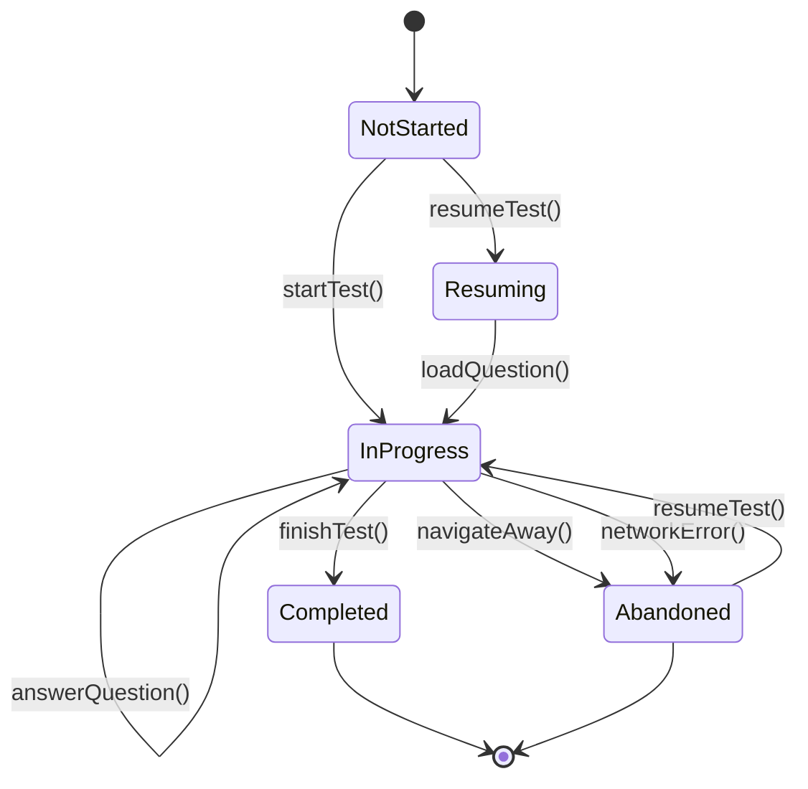
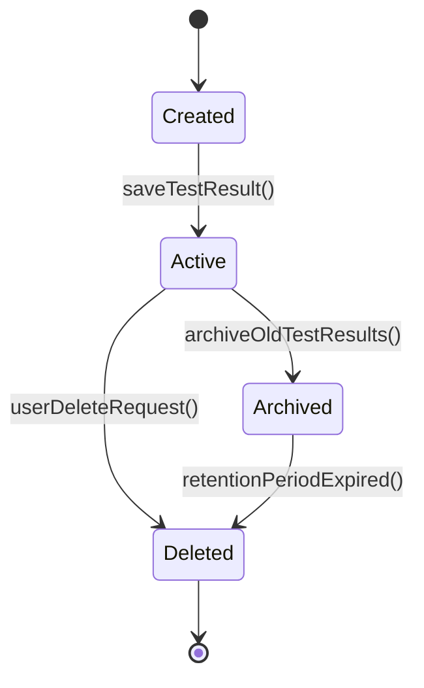
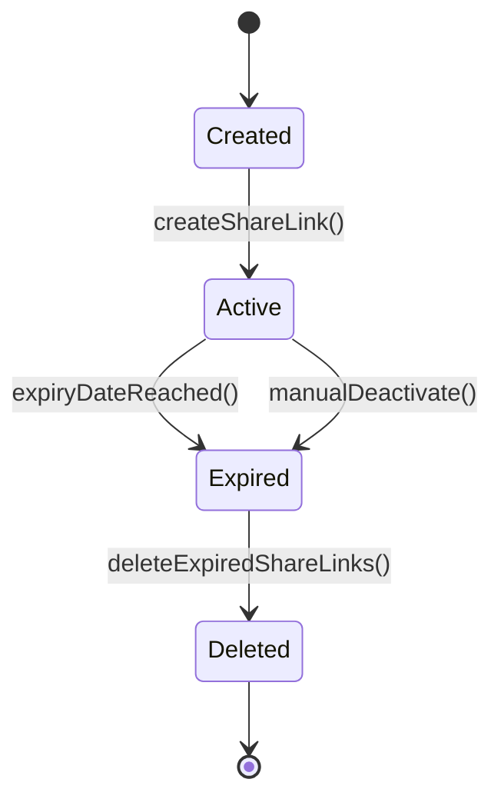
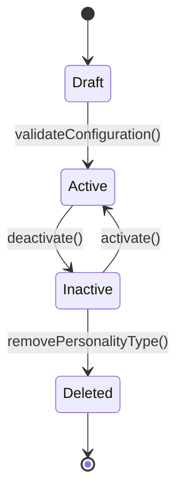
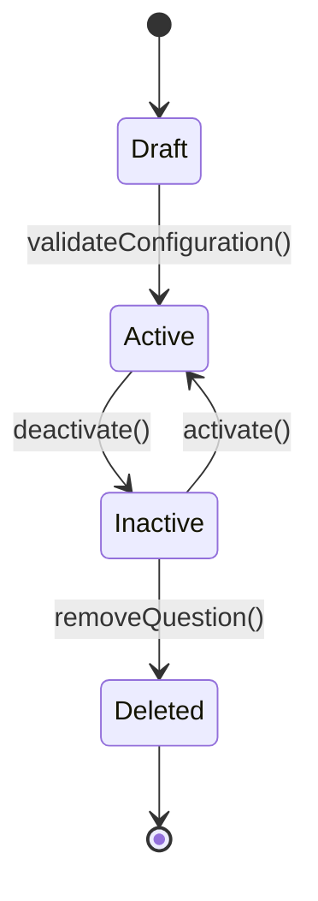
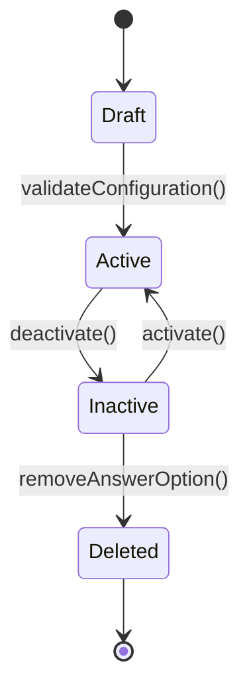
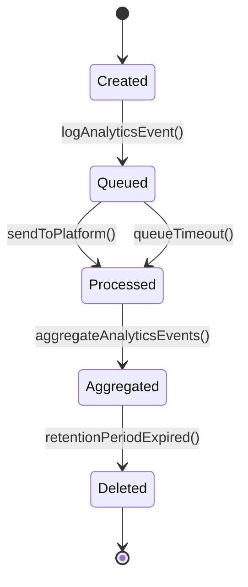
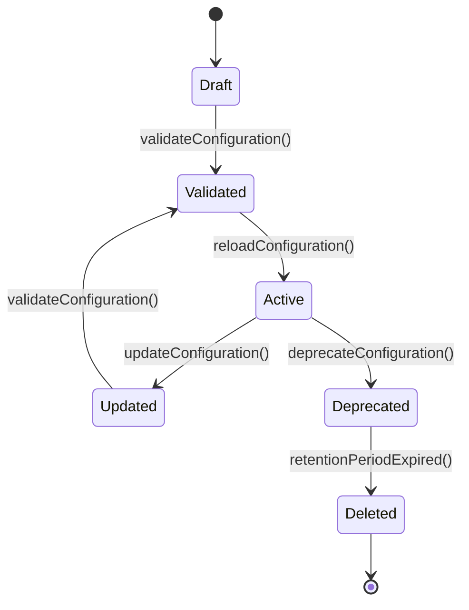

# Object Life Cycle

## Document Information
- **Project**: ChickPersonality
- **Based on**: Use Cases (Step 3), Data Model (Step 4), Function List (Step 7)
- **Version**: 1.0
- **Last Updated**: 2026-05-27

---

## 1. Entity: TestSession

**Description**: Represents a user's personality test session from start to completion or abandonment. This is a transient entity managed in local storage and server-side session tracking.

### State Diagram

### State Definitions

| State | Description | Entry Conditions | Exit Conditions | Allowed Actions |
|-------|-------------|------------------|-----------------|-----------------|
| NotStarted | Initial state before user begins test | User lands on landing page | startTest() called | startTest, checkProgress |
| Resuming | User is resuming from saved progress | Saved progress detected in local storage | loadQuestion() called | loadQuestion, cancelResume |
| InProgress | User is actively answering questions | Test started or resumed | finishTest() or abandonment | answerQuestion, navigateToQuestion, saveAnswer |
| Completed | User has answered all questions and results calculated | All questions answered, scores calculated | None (terminal) | viewResults, shareResults, retakeTest |
| Abandoned | User left test without completion | User navigated away or network error | resumeTest() or timeout | resumeTest, clearProgress |

### Transition Rules

| From State | To State | Trigger | Guard Condition | Action | Actor |
|------------|----------|---------|-----------------|--------|-------|
| NotStarted | InProgress | startTest() | Configuration is valid | Clear local storage, initialize session, log analytics event | Primary User |
| NotStarted | Resuming | checkTestProgress() | Saved progress exists | Display resume confirmation dialog | System |
| Resuming | InProgress | loadQuestion() | User confirms resume | Load last unanswered question | Primary User |
| InProgress | InProgress | answerQuestion() | Answer selected | Save answer to local storage, update progress | Primary User |
| InProgress | InProgress | navigateToQuestion() | Previous/Next clicked | Load requested question | Primary User |
| InProgress | Completed | finishTest() | All questions answered | Calculate scores, save result, display results | Primary User |
| InProgress | Abandoned | navigateAway() | User navigates away | Save progress to local storage, log abandonment event | Primary User |
| InProgress | Abandoned | networkError() | Network connection fails | Display error message, preserve progress | System |
| Abandoned | InProgress | resumeTest() | User returns and confirms resume | Load saved progress | Primary User |

### State-Specific Business Rules

**State: NotStarted**
- Configuration must be validated before allowing startTest()
- Check for existing saved progress and offer resume option
- Log "test_started" analytics event when transitioning to InProgress

**State: InProgress**
- Progress must be saved to local storage after each answer (BR-003)
- Question transitions must complete within 500ms (BR-004)
- User cannot proceed without selecting an answer (BR-002)
- Maximum 3 retry attempts for network errors (BR-043)

**State: Completed**
- Results must be calculated before displaying (F-008, F-009, F-010)
- Share link must be created automatically (F-071)
- Log "test_completed" analytics event with personality type and time taken

**State: Abandoned**
- Progress must be preserved in local storage (BR-042)
- Log "test_abandoned" analytics event with last question and time spent
- Offer resume option when user returns

### Audit Trail Requirements

**Transitions to Log:**
- NotStarted → InProgress: Log test start with timestamp, session ID, device type
- InProgress → Completed: Log test completion with personality type, time taken, score breakdown
- InProgress → Abandoned: Log abandonment with last question, time spent, reason (network/user action)
- Abandoned → InProgress: Log resume event with timestamp

**Data to Capture:**
- Who: Anonymous session ID (UUID v4), hashed IP address
- When: Timestamp in UTC
- From State: Previous state
- To State: New state
- Reason: User action or system event
- Context: Device type, current question number, personality type (if completed)

---

## 2. Entity: TestResult

**Description**: A completed personality test result with calculated scores, primary personality type, and share token. This entity persists in the database.

### State Diagram

### State Definitions

| State | Description | Entry Conditions | Exit Conditions | Allowed Actions |
|-------|-------------|------------------|-----------------|-----------------|
| Created | Test result calculated but not yet persisted | Scores calculated, personality type determined | saveTestResult() called | validateScores, generateShareToken |
| Active | Test result is persisted and accessible via share link | Successfully saved to database | Archive or delete | retrieveResult, incrementClicks, viewResults |
| Archived | Test result is archived after 90 days | 90 days since completion | Retention period expired | No access (read-only for analytics) |
| Deleted | Test result is permanently removed | Archive period expired or user request | None (terminal) | None |

### Transition Rules

| From State | To State | Trigger | Guard Condition | Action | Actor |
|------------|----------|---------|-----------------|--------|-------|
| Created | Active | saveTestResult() | Scores validated, percentages sum to 100% | Persist to database, generate share token, create share link | System |
| Active | Archived | archiveOldTestResults() | 90 days since completed_at | Move to archive storage, aggregate analytics | System (Maintenance Job) |
| Active | Deleted | userDeleteRequest() | User requests deletion (Phase 2) | Hard delete from database, log deletion event | User (Phase 2) |
| Archived | Deleted | retentionPeriodExpired() | 180 days since completion (90 days archived) | Permanently delete from storage | System (Maintenance Job) |

### State-Specific Business Rules

**State: Created**
- Score breakdown must include percentages for all 7 personality types (BR-DM-016)
- Percentages must sum to 100% within 1% tolerance (BR-DM-017)
- Share token must be unique and cryptographically random (BR-DM-015)
- IP address must be hashed before storage (BR-DM-018)

**State: Active**
- Accessible via share token for 30 days (via ShareLink entity)
- Click count incremented on each access (BR-DM-025)
- Cannot be modified after creation (immutable)
- Secondary personality types identified if within 10% of primary score (BR-009)

**State: Archived**
- No longer accessible via share link
- Data retained for analytics aggregation only
- Aggregated into daily/monthly statistics
- Original data may be deleted after 180 days total

**State: Deleted**
- Permanently removed from database
- Cannot be recovered
- Audit log retains deletion record

### Audit Trail Requirements

**Transitions to Log:**
- Created → Active: Log result creation with personality type, score breakdown, device type
- Active → Archived: Log archival with result ID, archive date, reason (retention policy)
- Active → Deleted: Log deletion with result ID, deletion date, reason (user request or policy)
- Archived → Deleted: Log permanent deletion with result ID, deletion date

**Data to Capture:**
- Who: System (maintenance job) or User (if user-initiated deletion)
- When: Timestamp in UTC
- From State: Previous state
- To State: New state
- Reason: Retention policy, user request, or system maintenance
- Context: Result ID, personality type, score breakdown (for archival)

---

## 3. Entity: ShareLink

**Description**: Unique shareable link for test results with expiration and click tracking. Enables users to share their personality results.

### State Diagram

### State Definitions

| State | Description | Entry Conditions | Exit Conditions | Allowed Actions |
|-------|-------------|------------------|-----------------|-----------------|
| Created | Share link generated but not yet persisted | Test result saved | createShareLink() called | generateUrl, setExpiry |
| Active | Share link is valid and accessible | Successfully saved to database | Expiry date reached or manual deactivation | accessResult, incrementClicks |
| Expired | Share link has passed expiration date | expires_at < NOW() | Deleted by maintenance job | No access (redirect to landing page) |
| Deleted | Share link is permanently removed | Expired and cleaned up | None (terminal) | None |

### Transition Rules

| From State | To State | Trigger | Guard Condition | Action | Actor |
|------------|----------|---------|-----------------|--------|-------|
| Created | Active | createShareLink() | Test result exists | Generate unique URL, set expiry to 30 days, persist to database | System |
| Active | Expired | expiryDateReached() | expires_at < NOW() | Mark as expired, prevent access | System (Automatic) |
| Active | Expired | manualDeactivate() | Administrator or user requests deactivation | Set expires_at to NOW() | Administrator (Phase 2) |
| Expired | Deleted | deleteExpiredShareLinks() | Link is expired | Hard delete from database | System (Maintenance Job) |

### State-Specific Business Rules

**State: Created**
- Share URL must be unique and include the share token (BR-DM-024)
- Expiration date set to 30 days from creation (BR-DM-023)
- Click count initialized to 0

**State: Active**
- Click count incremented each time the link is accessed (BR-DM-025)
- Last clicked at timestamp updated on each access
- Redirects to results page if test result is still active
- Redirects to landing page with expiry message if test result is archived/deleted

**State: Expired**
- Redirects to landing page with message: "This shared result has expired. Take the test to get new results." (BR-DM-026)
- No access to test result data
- Click count no longer incremented

**State: Deleted**
- Permanently removed from database
- Cannot be recovered
- Audit log retains deletion record

### Audit Trail Requirements

**Transitions to Log:**
- Created → Active: Log share link creation with result ID, share token, expiry date
- Active → Expired: Log expiry with share link ID, expiry date, reason (automatic or manual)
- Expired → Deleted: Log deletion with share link ID, deletion date, click count

**Data to Capture:**
- Who: System (automatic) or Administrator (manual deactivation)
- When: Timestamp in UTC
- From State: Previous state
- To State: New state
- Reason: Expiration policy, manual deactivation, or cleanup job
- Context: Share link ID, share token, click count, result ID

---

## 4. Entity: PersonalityType

**Description**: One of the 7 chick personality archetypes with unique themes, traits, and visual characteristics. Managed by Content Administrator.

### State Diagram

### State Definitions

| State | Description | Entry Conditions | Exit Conditions | Allowed Actions |
|-------|-------------|------------------|-----------------|-----------------|
| Draft | Personality type is being created or modified | Administrator adds/edits type | validateConfiguration() called | editFields, setPriority, defineTraits |
| Active | Personality type is available for use in tests | Configuration validated, is_active=true | deactivate() called | useInScoring, displayInResults |
| Inactive | Personality type is temporarily disabled | is_active=false | activate() called | viewDetails, editFields |
| Deleted | Personality type is permanently removed | removePersonalityType() called | None (terminal) | None |

### Transition Rules

| From State | To State | Trigger | Guard Condition | Action | Actor |
|------------|----------|---------|-----------------|--------|-------|
| Draft | Active | validateConfiguration() | All required fields filled, priority unique | Set is_active=true, reload configuration | Content Administrator |
| Active | Inactive | deactivate() | No active test results reference this type | Set is_active=false, reload configuration | Content Administrator |
| Inactive | Active | activate() | Exactly 6 other types active (to maintain 7 total) | Set is_active=true, reload configuration | Content Administrator |
| Inactive | Deleted | removePersonalityType() | No test results reference this type | Hard delete from database, update scoring weights | Content Administrator |

### State-Specific Business Rules

**State: Draft**
- Must include: name, slug, theme, color palette, traits, description, strengths, weaknesses, compatibility matrix
- Priority order must be unique (1-7) (BR-DM-003)
- Color palette must include at least primary and secondary colors (BR-DM-004)
- Compatibility matrix must include scores for all other personality types (BR-DM-005)

**State: Active**
- Exactly 7 personality types must be active at any time (BR-DM-001)
- Used in scoring calculations for all answer options
- Displayed in results when assigned as primary or secondary type
- Cannot be deleted if referenced by test results (ON DELETE RESTRICT)

**State: Inactive**
- Not used in scoring calculations for new tests
- Existing test results with this type remain valid
- Can be reactivated if needed
- Can be deleted if no test results reference it

**State: Deleted**
- Permanently removed from database
- Cannot be recovered
- All scoring weights for this type must be removed from answer options
- Audit log retains deletion record

### Audit Trail Requirements

**Transitions to Log:**
- Draft → Active: Log activation with type ID, name, priority, administrator
- Active → Inactive: Log deactivation with type ID, name, reason, administrator
- Inactive → Active: Log reactivation with type ID, name, administrator
- Inactive → Deleted: Log deletion with type ID, name, administrator, reason

**Data to Capture:**
- Who: Content Administrator (user ID or name)
- When: Timestamp in UTC
- From State: Previous state
- To State: New state
- Reason: Content update, testing, or retirement
- Context: Type ID, name, priority order, changes made

---

## 5. Entity: Question

**Description**: A single question in the personality test with multiple answer options. Managed by Content Administrator.

### State Diagram

### State Definitions

| State | Description | Entry Conditions | Exit Conditions | Allowed Actions |
|-------|-------------|------------------|-----------------|-----------------|
| Draft | Question is being created or modified | Administrator adds/edits question | validateConfiguration() called | editText, setNumber, addOptions |
| Active | Question is available in tests | Configuration validated, is_active=true | deactivate() called | displayInTest, answerByUser |
| Inactive | Question is temporarily disabled | is_active=false | activate() called | viewDetails, editFields |
| Deleted | Question is permanently removed | removeQuestion() called | None (terminal) | None |

### Transition Rules

| From State | To State | Trigger | Guard Condition | Action | Actor |
|------------|----------|---------|-----------------|--------|-------|
| Draft | Active | validateConfiguration() | Text valid, 4-5 active options, number unique | Set is_active=true, reload configuration | Content Administrator |
| Active | Inactive | deactivate() | At least 20 other questions active | Set is_active=false, reload configuration | Content Administrator |
| Inactive | Active | activate() | At least 19 other questions active (to maintain minimum 20) | Set is_active=true, reload configuration | Content Administrator |
| Inactive | Deleted | removeQuestion() | No test answers reference this question | Hard delete from database (cascade to options) | Content Administrator |

### State-Specific Business Rules

**State: Draft**
- Question text must be clear and concise (max 200 characters recommended) (BR-DM-008)
- Must have 4-5 active answer options (BR-DM-010)
- Question number must be sequential and unique (1-30) (BR-DM-006)
- All answer options must have scoring weights for all active personality types (BR-DM-011)

**State: Active**
- At least 20 questions must be active for a valid test (BR-DM-007)
- Displayed to users in sequential order
- Each question must have exactly one selected answer (BR-002)
- Cannot be deleted if test answers reference it (ON DELETE RESTRICT)

**State: Inactive**
- Not displayed in tests
- Can be edited and reactivated
- Existing test answers remain valid
- Can be deleted if no test answers reference it

**State: Deleted**
- Permanently removed from database
- Cascade deletes all associated answer options (ON DELETE CASCADE)
- Cannot be recovered
- Audit log retains deletion record

### Audit Trail Requirements

**Transitions to Log:**
- Draft → Active: Log activation with question ID, number, text, administrator
- Active → Inactive: Log deactivation with question ID, number, reason, administrator
- Inactive → Active: Log reactivation with question ID, number, administrator
- Inactive → Deleted: Log deletion with question ID, number, administrator, reason

**Data to Capture:**
- Who: Content Administrator (user ID or name)
- When: Timestamp in UTC
- From State: Previous state
- To State: New state
- Reason: Content update, testing, or retirement
- Context: Question ID, number, text, options count

---

## 6. Entity: AnswerOption

**Description**: An answer option for a question with scoring weights for each personality type. Managed by Content Administrator.

### State Diagram

### State Definitions

| State | Description | Entry Conditions | Exit Conditions | Allowed Actions |
|-------|-------------|------------------|-----------------|-----------------|
| Draft | Answer option is being created or modified | Administrator adds/edits option | validateConfiguration() called | editText, setOrder, setWeights |
| Active | Answer option is available in tests | Configuration validated, is_active=true | deactivate() called | displayInQuestion, selectByUser |
| Inactive | Answer option is temporarily disabled | is_active=false | activate() called | viewDetails, editFields |
| Deleted | Answer option is permanently removed | removeAnswerOption() called | None (terminal) | None |

### Transition Rules

| From State | To State | Trigger | Guard Condition | Action | Actor |
|------------|----------|---------|-----------------|--------|-------|
| Draft | Active | validateConfiguration() | Text valid, weights defined, order unique | Set is_active=true, reload configuration | Content Administrator |
| Active | Inactive | deactivate() | Question has at least 4 other active options | Set is_active=false, reload configuration | Content Administrator |
| Inactive | Active | activate() | Question has at most 4 other active options (to maintain 4-5 total) | Set is_active=true, reload configuration | Content Administrator |
| Inactive | Deleted | removeAnswerOption() | No test answers reference this option | Hard delete from database | Content Administrator |

### State-Specific Business Rules

**State: Draft**
- Option text must be clear and concise (max 255 characters)
- Scoring weights must include values for all active personality types (BR-DM-011)
- Weight values must be non-negative integers (0-10 recommended) (BR-DM-012)
- Option order must be unique within the question (BR-DM-013)
- Scoring weights JSON structure: `{"personality_type_slug": weight_value}` (BR-DM-014)

**State: Active**
- Each question must have 4-5 active answer options (BR-DM-010)
- Displayed to users in specified order
- Selected by user during test
- Cannot be deleted if test answers reference it (ON DELETE RESTRICT)

**State: Inactive**
- Not displayed in tests
- Can be edited and reactivated
- Existing test answers remain valid
- Can be deleted if no test answers reference it

**State: Deleted**
- Permanently removed from database
- Cannot be recovered
- Audit log retains deletion record

### Audit Trail Requirements

**Transitions to Log:**
- Draft → Active: Log activation with option ID, question ID, text, administrator
- Active → Inactive: Log deactivation with option ID, question ID, reason, administrator
- Inactive → Active: Log reactivation with option ID, question ID, administrator
- Inactive → Deleted: Log deletion with option ID, question ID, administrator, reason

**Data to Capture:**
- Who: Content Administrator (user ID or name)
- When: Timestamp in UTC
- From State: Previous state
- To State: New state
- Reason: Content update, testing, or retirement
- Context: Option ID, question ID, text, order, scoring weights

---

## 7. Entity: AnalyticsEvent

**Description**: Anonymized analytics events for tracking user behavior and app performance. Created automatically by system actions.

### State Diagram

### State Definitions

| State | Description | Entry Conditions | Exit Conditions | Allowed Actions |
|-------|-------------|------------------|-----------------|-----------------|
| Created | Analytics event is generated by user action or system event | Event occurs (page view, test completion, etc.) | logAnalyticsEvent() called | sanitizeData, generateSessionId |
| Queued | Event is queued for sending to analytics platform | Sanitization complete | Platform available or queue timeout | sendToPlatform, retrySend |
| Processed | Event is successfully sent to analytics platform | Platform confirms receipt | Aggregation job runs | viewInDashboard, queryData |
| Aggregated | Event is aggregated into daily/monthly statistics | Aggregation job completed | Retention period expired | viewAggregatedStats |
| Deleted | Event is permanently removed after retention period | 1 year since occurred_at | None (terminal) | None |

### Transition Rules

| From State | To State | Trigger | Guard Condition | Action | Actor |
|------------|----------|---------|-----------------|--------|-------|
| Created | Queued | logAnalyticsEvent() | Data sanitized, no PII | Add to send queue, set timestamp | System |
| Queued | Processed | sendToPlatform() | Analytics platform available | Send event to platform, mark as processed | System |
| Queued | Processed | queueTimeout() | Queue timeout reached (e.g., 5 minutes) | Mark as processed (failed), log error | System |
| Processed | Aggregated | aggregateAnalyticsEvents() | Aggregation job runs (hourly) | Aggregate into daily/monthly statistics | System (Maintenance Job) |
| Aggregated | Deleted | retentionPeriodExpired() | 1 year since occurred_at | Delete raw event data | System (Maintenance Job) |

### State-Specific Business Rules

**State: Created**
- All analytics events must be anonymized (no PII) (BR-DM-027)
- Session ID must be a random UUID, not linked to user identity (BR-DM-028)
- IP addresses must be hashed before storage (BR-DM-029)
- Event types must be from predefined list (BR-DM-031)

**State: Queued**
- Events queued locally if platform unavailable
- Retry with exponential backoff
- Maximum queue size limit (e.g., 1000 events)
- Queue timeout to prevent stale events

**State: Processed**
- Events stored in analytics platform
- Accessible via analytics dashboard
- Can be queried for reports and insights
- Raw data retained for 1 year

**State: Aggregated**
- Raw events aggregated into daily/monthly statistics
- Aggregated data stored permanently
- Used for long-term trend analysis
- Raw events deleted after aggregation

**State: Deleted**
- Permanently removed from database
- Cannot be recovered
- Audit log retains deletion record
- Aggregated statistics remain available

### Audit Trail Requirements

**Transitions to Log:**
- Created → Queued: Log event creation with event type, session ID, timestamp
- Queued → Processed: Log successful send with event ID, platform, timestamp
- Queued → Processed (timeout): Log send failure with event ID, error, timestamp
- Processed → Aggregated: Log aggregation with event count, time range, timestamp
- Aggregated → Deleted: Log deletion with event count, time range, timestamp

**Data to Capture:**
- Who: System (automated)
- When: Timestamp in UTC
- From State: Previous state
- To State: New state
- Reason: Event lifecycle progression
- Context: Event type, session ID, device type, personality type (if applicable)

---

## 8. Entity: Configuration

**Description**: Application configuration settings for test behavior, scoring, and features. Managed by Content Administrator.

### State Diagram

### State Definitions

| State | Description | Entry Conditions | Exit Conditions | Allowed Actions |
|-------|-------------|------------------|-----------------|-----------------|
| Draft | Configuration is being created or modified | Administrator edits configuration | validateConfiguration() called | editValue, setDescription, setPublicFlag |
| Validated | Configuration has passed validation | Validation successful | reloadConfiguration() called | viewDetails, deploy |
| Active | Configuration is loaded and in use | Successfully reloaded by application | updateConfiguration() called | readByApplication, readByFrontend (if public) |
| Updated | Configuration has been modified but not yet reloaded | Administrator saves changes | validateConfiguration() called | editValue, setDescription |
| Deprecated | Configuration is no longer in use | Administrator marks as deprecated | Retention period expired | viewHistory |
| Deleted | Configuration is permanently removed | Retention period expired | None (terminal) | None |

### Transition Rules

| From State | To State | Trigger | Guard Condition | Action | Actor |
|------------|----------|---------|-----------------|--------|-------|
| Draft | Validated | validateConfiguration() | Structure valid, constraints met | Mark as validated, log validation result | Content Administrator |
| Validated | Active | reloadConfiguration() | Deployment triggered | Reload configuration in application, mark as active | Content Administrator / System |
| Active | Updated | updateConfiguration() | Administrator saves changes | Mark as updated, require revalidation | Content Administrator |
| Updated | Validated | validateConfiguration() | Structure valid, constraints met | Mark as validated, ready for reload | Content Administrator |
| Active | Deprecated | deprecateConfiguration() | No longer needed | Mark as deprecated, prevent use | Content Administrator |
| Deprecated | Deleted | retentionPeriodExpired() | 1 year since deprecation | Hard delete from database | System (Maintenance Job) |

### State-Specific Business Rules

**State: Draft**
- Configuration keys must be unique (BR-DM-032)
- Public configurations can be accessed by frontend without authentication (BR-DM-033)
- Sensitive configurations (API keys, secrets) must never be public (BR-DM-034)

**State: Validated**
- Configuration structure and constraints validated
- Ready for deployment
- Changes not yet applied to running application

**State: Active**
- Configuration is loaded and in use by application
- Public configurations accessible to frontend
- Private configurations accessible only server-side
- Configuration changes should be logged for audit (BR-DM-035)

**State: Updated**
- Configuration has been modified
- Requires validation before becoming active
- Previous active version remains in use until reload

**State: Deprecated**
- No longer in use by application
- Retained for historical reference
- Can be reactivated if needed

**State: Deleted**
- Permanently removed from database
- Cannot be recovered
- Audit log retains deletion record
- Change history retained separately

### Audit Trail Requirements

**Transitions to Log:**
- Draft → Validated: Log validation with config key, validation result, administrator
- Validated → Active: Log deployment with config key, previous value, new value, administrator
- Active → Updated: Log modification with config key, previous value, new value, administrator
- Updated → Validated: Log revalidation with config key, validation result, administrator
- Active → Deprecated: Log deprecation with config key, reason, administrator
- Deprecated → Deleted: Log deletion with config key, deletion date, reason

**Data to Capture:**
- Who: Content Administrator (user ID or name)
- When: Timestamp in UTC
- From State: Previous state
- To State: New state
- Reason: Configuration update, deprecation, or retention policy
- Context: Config key, previous value, new value, is_public flag

---

## 9. Cross-Entity State Dependencies

### TestSession → TestResult
- TestSession.Completed state triggers TestResult.Created state
- TestSession.Abandoned state does not create TestResult
- TestSession.InProgress state cannot transition to Completed if TestResult creation fails

### TestResult → ShareLink
- TestResult.Active state triggers ShareLink.Created state
- ShareLink.Active state depends on TestResult.Active state
- ShareLink.Expired state can occur even if TestResult is still Active

### PersonalityType → AnswerOption
- PersonalityType.Active state required for AnswerOption scoring weights
- PersonalityType.Inactive state excludes type from new scoring calculations
- AnswerOption.Active state requires all referenced PersonalityType to be Active

### Question → AnswerOption
- Question.Active state requires at least 4 AnswerOption.Active states
- Question.Deleted state cascades to AnswerOption.Deleted state
- AnswerOption.Active state requires parent Question to be Active

### Configuration → All Entities
- Configuration.Active state affects behavior of all entities
- PersonalityType, Question, AnswerOption transitions depend on Configuration validation
- TestSession, TestResult behavior depends on Configuration settings

---

## 10. State Transition Failure Handling

### TestSession State Failures
- **startTest() failure**: Remain in NotStarted, display error message, offer retry
- **answerQuestion() failure**: Remain in InProgress, preserve progress, display error
- **finishTest() failure**: Remain in InProgress, preserve answers, offer retry
- **resumeTest() failure**: Offer to start fresh test, clear corrupted progress

### TestResult State Failures
- **saveTestResult() failure**: Log error, keep results in memory, offer manual retry
- **archiveOldTestResults() failure**: Log error, retry in next maintenance cycle
- **userDeleteRequest() failure**: Log error, notify user, retry automatically

### ShareLink State Failures
- **createShareLink() failure**: Log error, display error to user, offer copy link instead
- **accessResult() failure**: Log error, display "Link not found" message
- **deleteExpiredShareLinks() failure**: Log error, retry in next maintenance cycle

### Configuration State Failures
- **validateConfiguration() failure**: Display validation errors, prevent deployment
- **reloadConfiguration() failure**: Rollback to previous valid configuration, log error
- **updateConfiguration() failure**: Log error, preserve previous value, notify administrator

---

## 11. State Monitoring and Alerts

### Critical State Transitions to Monitor
- TestSession.InProgress → Abandoned: High abandonment rate may indicate UX issues
- TestResult.Created → Active failure: Database issues preventing result persistence
- ShareLink.Active → Expired: Monitor expiry patterns for user engagement
- PersonalityType.Active → Inactive: Ensure minimum 7 active types maintained
- Configuration.Validated → Active failure: Deployment issues affecting application

### Alert Thresholds
- **Test abandonment rate**: Alert if > 30% abandonment rate in 1-hour window
- **TestResult creation failures**: Alert if > 5% failure rate in 1-hour window
- **ShareLink expiry rate**: Alert if > 80% of links expire unused
- **Configuration reload failures**: Immediate alert on any failure
- **Active personality type count**: Alert if not exactly 7

### Monitoring Metrics
- State transition counts per entity type
- Average time spent in each state
- Failure rate per transition type
- State distribution (current count per state)
- Cross-entity state dependency health

---

**Document Version**: 1.0  
**Last Updated**: 2026-05-27  
**Status**: Draft - Ready for Review  
**Next Step**: Proceed to `/aspec-11-persistence` - Generate Persistence Design (Step 11)
