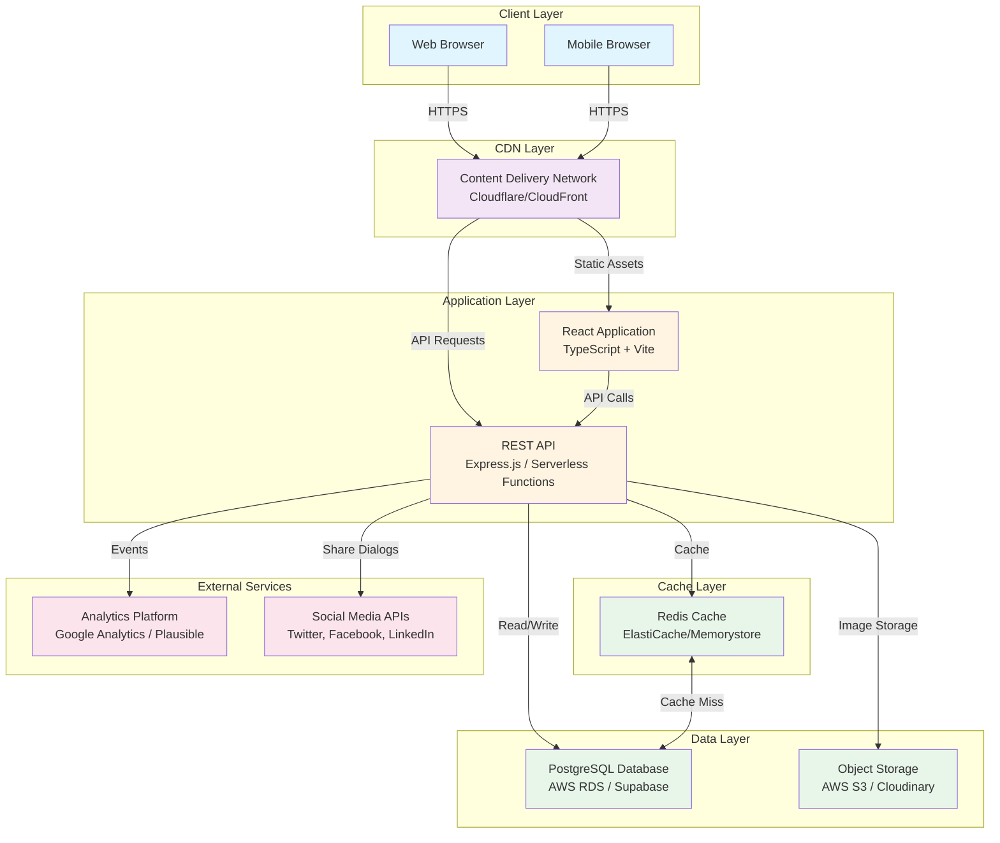
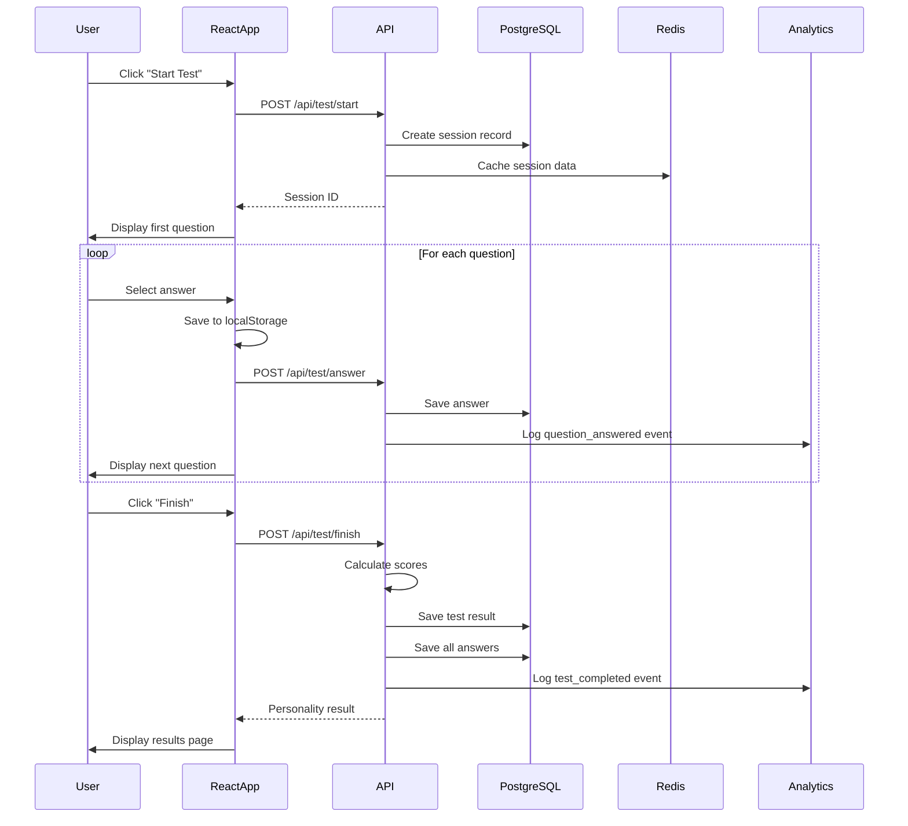
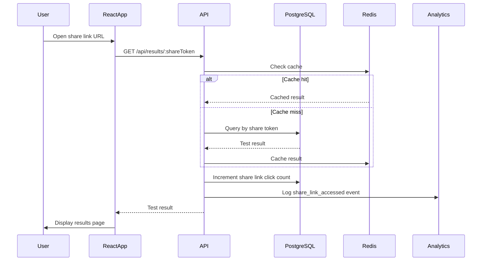

# Architecture Summary

## Document Information
- **Project**: ChickPersonality
- **Based on**: Project Spec (Step 1), User Stories (Step 2), Use Cases (Step 3), Data Model (Step 4), Data Structure (Step 5), Actor List (Step 6), Function List (Step 7), Action-Function Table (Step 8), Access Control (Step 9), Object Lifecycle (Step 10), Persistence Design (Step 11)
- **Architecture Type**: Monolith
- **Version**: 1.0
- **Last Updated**: 2026-05-27

---

## 1. Architecture Overview Diagram



---

## 2. Layer Structure

| Layer | Responsibility | Technology |
|-------|---------------|------------|
| **Client Layer** | User interface, client-side state management, user interactions | React 18+, TypeScript, Tailwind CSS, Framer Motion, Lucide React |
| **CDN Layer** | Static asset delivery, global edge caching, SSL termination | Cloudflare or CloudFront (built-in with Vercel/Netlify) |
| **Application Layer** | API endpoints, business logic, scoring algorithm, request handling | Express.js or Serverless Functions (AWS Lambda / Vercel Functions), Node.js 18+ |
| **Cache Layer** | Frequently accessed data caching, session caching, performance optimization | Redis 7+ (ElastiCache or Memorystore) |
| **Data Layer** | Persistent data storage, relational data, transaction management | PostgreSQL 15+ (AWS RDS or Supabase) |
| **Object Storage** | Generated images, static assets, file storage | AWS S3 or Cloudinary |
| **External Services** | Analytics tracking, social media sharing integration | Google Analytics / Plausible, Twitter/Facebook/LinkedIn APIs |

---

## 3. Technology Stack Summary

| Layer | Technology | Justification |
|-------|------------|---------------|
| **Frontend Framework** | React 18+ with TypeScript | Component-based architecture, strong typing, large ecosystem, excellent performance |
| **State Management** | Zustand or Redux Toolkit | Simple state management for test session, lightweight, TypeScript support |
| **Styling** | Tailwind CSS with custom theme | Utility-first CSS, rapid development, easy customization for personality themes |
| **Animations** | Framer Motion | Declarative animations, smooth transitions, accessibility support |
| **Build Tool** | Vite | Fast development server, optimized production builds, modern tooling |
| **Backend Runtime** | Node.js 18+ | JavaScript/TypeScript consistency, large ecosystem, serverless support |
| **API Framework** | Express.js or Serverless Functions | Simple REST API, easy deployment, serverless scalability |
| **Database** | PostgreSQL 15+ | Relational data integrity, JSONB support for flexible schemas, ACID compliance |
| **Cache** | Redis 7+ | In-memory caching, session management, high performance |
| **Object Storage** | AWS S3 or Cloudinary | Scalable image storage, CDN integration, cost-effective |
| **Hosting** | Vercel or Netlify | Zero-config deployment, automatic HTTPS, global CDN, preview deployments |
| **Database Hosting** | AWS RDS or Supabase | Managed PostgreSQL, automated backups, high availability |
| **Analytics** | Google Analytics or Plausible | User behavior tracking, privacy-focused (Plausible), easy integration |
| **Testing** | Jest, React Testing Library, Playwright | Unit testing, component testing, E2E testing |
| **CI/CD** | GitHub Actions | Automated testing, deployment pipelines, version control integration |

---

## 4. Communication Patterns

### Synchronous Communication

**HTTP/REST API:**
- **Protocol**: HTTPS with TLS 1.3
- **Format**: JSON request/response
- **Authentication**: None required (Phase 1 - public access)
- **Rate Limiting**: 100 requests per minute per IP address
- **Endpoints**:
  - `GET /api/questions` - Retrieve active questions with answer options
  - `POST /api/test/start` - Initialize test session
  - `POST /api/test/answer` - Submit answer for a question
  - `POST /api/test/finish` - Complete test and calculate results
  - `GET /api/results/:shareToken` - Retrieve test result by share token
  - `POST /api/share/create` - Create shareable link for results
  - `GET /api/config/public` - Retrieve public configuration
  - `POST /api/image/generate` - Generate shareable image card

**Client-Server Communication:**
- React app makes HTTP requests to API endpoints
- API processes requests and returns JSON responses
- Error handling with user-friendly messages
- Retry logic for network failures (exponential backoff)

### Asynchronous Communication

**Analytics Event Logging:**
- **Pattern**: Fire-and-forget (non-blocking)
- **Implementation**: Client-side analytics SDK with local queue
- **Fallback**: Queue events locally if analytics platform unavailable
- **Batching**: Batch events before sending to reduce network calls

**Image Generation:**
- **Pattern**: Async processing with polling or webhook
- **Implementation**: Server-side image generation service
- **Timeout**: 3-second timeout with fallback to alternative sharing methods

### Client-Side Communication

**Local Storage:**
- **Purpose**: Save test progress during session
- **API**: Browser localStorage API
- **Data**: Session state, answered questions, current question number
- **Cleanup**: Clear after test completion or on retake

**Browser Events:**
- **Purpose**: Handle user interactions, device changes
- **Events**: Click, tap, swipe, keyboard events, orientation change
- **Delegation**: Event delegation for performance

---

## 5. Data Flow

### Test Completion Flow



### Share Link Access Flow



---

## 6. Security Architecture

### Security Layers

**Layer 1: Network Security**
- **TLS 1.3**: All communications encrypted
- **HTTPS Only**: Redirect HTTP to HTTPS
- **HSTS**: HTTP Strict Transport Security header
- **CDN Protection**: DDoS protection via Cloudflare

**Layer 2: Application Security**
- **Input Validation**: All user input validated and sanitized
- **XSS Prevention**: Content Security Policy, output encoding
- **CSRF Protection**: CSRF tokens for state-changing operations (Phase 2)
- **Rate Limiting**: Per-IP rate limiting on all endpoints
- **Security Headers**: Content-Security-Policy, X-Frame-Options, X-Content-Type-Options

**Layer 3: Data Security**
- **Encryption at Rest**: AES-256 encryption for database
- **PII Protection**: No PII collected, IP addresses hashed
- **Data Retention**: Automatic cleanup after retention periods
- **Audit Logging**: Configuration changes logged

**Layer 4: Access Control**
- **Phase 1**: Public access (no authentication)
- **Phase 2**: JWT-based authentication, RBAC
- **Admin Access**: Infrastructure-level separation (not web app)

### Security Headers

```
Content-Security-Policy: default-src 'self'; script-src 'self' 'unsafe-inline'; style-src 'self' 'unsafe-inline'; img-src 'self' data: https:; connect-src 'self' https:;
X-Content-Type-Options: nosniff
X-Frame-Options: DENY
X-XSS-Protection: 1; mode=block
Strict-Transport-Security: max-age=31536000; includeSubDomains
Referrer-Policy: strict-origin-when-cross-origin
Permissions-Policy: geolocation=(), microphone=(), camera=()
```

---

## 7. Deployment Architecture

### Development Environment

**Local Development:**
- **Frontend**: Vite dev server (localhost:5173)
- **Backend**: Express.js server (localhost:3000) or serverless functions
- **Database**: PostgreSQL via Docker or local installation
- **Cache**: Redis via Docker or local installation
- **Hot Reload**: Vite HMR for frontend, nodemon for backend

### Staging Environment

**Infrastructure:**
- **Frontend**: Vercel preview deployments
- **Backend**: Vercel Functions or AWS Lambda (staging)
- **Database**: AWS RDS PostgreSQL (staging instance)
- **Cache**: Redis (staging instance)
- **Domain**: staging.chickpersonality.com

**Deployment Process:**
1. Push to staging branch
2. GitHub Actions triggers CI/CD pipeline
3. Run automated tests
4. Deploy to Vercel preview
5. Run smoke tests
6. Manual QA verification

### Production Environment

**Infrastructure:**
- **Frontend**: Vercel (global edge network)
- **Backend**: Vercel Functions or AWS Lambda (us-east-1)
- **Database**: AWS RDS PostgreSQL Multi-AZ (us-east-1)
- **Cache**: Redis ElastiCache with replica (us-east-1)
- **CDN**: Cloudflare or Vercel Edge Network
- **Domain**: chickpersonality.com
- **SSL**: Automatic TLS certificate via Vercel/Cloudflare

**Deployment Process:**
1. Merge to main branch
2. GitHub Actions triggers CI/CD pipeline
3. Run automated tests (unit, integration, E2E)
4. Build production assets
5. Deploy to Vercel production
6. Run smoke tests
7. Monitor for errors
8. Rollback if issues detected

**High Availability:**
- **Multi-AZ Database**: Automatic failover
- **Redis Replica**: Read replica for cache
- **Global CDN**: Edge caching worldwide
- **Health Checks**: Automated health monitoring
- **Backup**: Daily automated backups with 7-day retention

---

## 8. Scalability Strategy

### Vertical Scaling (Phase 1)

**Current Capacity:**
- **Frontend**: Vercel (auto-scaling)
- **Backend**: Serverless (auto-scaling)
- **Database**: db.t3.medium (2 vCPU, 4 GB RAM)
- **Cache**: cache.t3.small (1 vCPU, 1.5 GB RAM)
- **Expected Load**: 1,000 tests/day, 10,000 analytics events/day

**Scaling Triggers:**
- CPU utilization > 70% for 1 hour
- Memory utilization > 80% for 1 hour
- Database connection pool > 80% utilization
- API latency P99 > 500ms

**Scaling Path:**
- **Database**: db.t3.medium → db.t3.large → db.m5.large → db.m5.xlarge
- **Cache**: cache.t3.small → cache.t3.medium → cache.m5.large
- **Serverless**: Automatic scaling based on request volume

### Horizontal Scaling (Phase 2+)

**Read Replicas:**
- Add 1-2 PostgreSQL read replicas for analytics queries
- Direct read traffic to replicas
- Primary handles only writes

**Database Sharding:**
- Consider sharding by tenant if multi-tenant (Phase 2+)
- Shard key: user_id or tenant_id
- Shard count: Start with 2 shards, scale as needed

**Caching Strategy:**
- Increase Redis cluster size
- Add cache layers (CDN, application cache, database cache)
- Implement cache warming for high-traffic periods

### Performance Optimization

**Frontend Optimization:**
- Code splitting (lazy loading)
- Tree shaking (remove unused code)
- Image optimization (WebP, lazy loading)
- Minification and compression
- Service worker for offline support (Phase 2)

**Backend Optimization:**
- Connection pooling (PgBouncer)
- Query optimization (index tuning)
- Batch operations (bulk inserts)
- Async processing (non-blocking tasks)
- Response caching (Redis)

**Database Optimization:**
- Index optimization based on query patterns
- Query plan analysis (EXPLAIN ANALYZE)
- Partitioning for large tables (Phase 2+)
- Materialized views for analytics (Phase 2+)

---

## 9. Monitoring and Observability

### Metrics to Monitor

**Application Metrics:**
- Request rate (requests per second)
- Response time (P50, P95, P99)
- Error rate (4xx, 5xx errors)
- Database query performance
- Cache hit ratio
- Serverless function duration and invocations

**Business Metrics:**
- Test completion rate
- Test abandonment rate
- Share rate (shares per completed test)
- Device type distribution
- Personality type distribution
- User session duration

**Infrastructure Metrics:**
- CPU utilization
- Memory utilization
- Disk I/O
- Network I/O
- Database connection pool utilization
- Redis memory usage

### Monitoring Tools

**Application Monitoring:**
- **Vercel Analytics**: Built-in frontend monitoring
- **Vercel Logs**: Serverless function logs
- **Sentry**: Error tracking and alerting
- **Google Analytics / Plausible**: User behavior analytics

**Infrastructure Monitoring:**
- **AWS CloudWatch**: Database and cache metrics
- **Cloudflare Analytics**: CDN metrics, security events
- **Uptime Robot**: Uptime monitoring and alerts

**Log Aggregation:**
- **Vercel Logs**: Centralized logging
- **CloudWatch Logs**: Database and cache logs
- **Sentry**: Error logs with stack traces

### Alerting Rules

**Critical Alerts (Immediate Notification):**
- API error rate > 5%
- Database unavailable
- Cache unavailable
- Serverless function error rate > 10%
- Security incident detected

**Warning Alerts (Within 1 Hour):**
- API latency P99 > 1 second
- Database CPU > 80%
- Cache hit ratio < 70%
- Test completion rate < 50%

**Info Alerts (Daily Summary):**
- Daily active users
- Test completion rate
- Share rate
- Infrastructure costs

---

## 10. Technology Rationale

### Why Monolith Architecture?

**Advantages for Phase 1:**
- **Simplicity**: Single codebase, easier to develop and maintain
- **Cost-Effective**: Lower infrastructure costs for MVP
- **Fast Development**: No distributed system complexity
- **Easier Testing**: Simple integration testing
- **Rapid Deployment**: Single deployment pipeline
- **Team Size**: Suitable for small team (1-2 developers)

**When to Consider Microservices (Phase 2+):**
- Team grows beyond 5-10 developers
- Need independent scaling of components
- Different technology requirements per service
- High availability requirements (>99.9%)
- Multiple teams working on different features

### Why React + TypeScript?

**React:**
- Component-based architecture matches UI requirements
- Large ecosystem and community support
- Excellent performance with virtual DOM
- Server-side rendering support (Phase 2)
- Mobile app potential with React Native (Phase 2)

**TypeScript:**
- Type safety reduces runtime errors
- Better IDE support and autocomplete
- Easier refactoring with type checking
- Self-documenting code
- Catches bugs at compile time

### Why PostgreSQL?

**Relational Database Benefits:**
- ACID compliance for data integrity
- Foreign key constraints for referential integrity
- JSONB support for flexible schemas (scoring weights, score breakdown)
- Complex queries for analytics
- Mature and battle-tested
- Excellent tooling and monitoring

**Why Not MongoDB:**
- Relational relationships are important (questions → answer options, test results → answers)
- ACID transactions needed for test result creation
- Complex analytics queries easier with SQL
- JSONB provides flexibility like MongoDB
- Better data integrity with constraints

### Why Serverless?

**Advantages:**
- Auto-scaling without configuration
- Pay-per-use pricing (cost-effective for MVP)
- No server management
- Built-in high availability
- Fast deployment
- Global edge distribution

**Considerations:**
- Cold starts (mitigated with provisioned concurrency)
- Execution time limits (suitable for API endpoints)
- Stateless design required (fits our architecture)

### Why Redis?

**Caching Benefits:**
- In-memory storage for fast access
- Reduces database load
- Session management
- Rate limiting support
- Pub/sub for future real-time features (Phase 2)

**Why Not Application-Level Cache:**
- Shared cache across multiple instances
- Persistent cache across deployments
- Advanced caching features (TTL, eviction policies)
- Monitoring and management tools

---

## 11. Future Architecture Evolution (Phase 2+)

### Planned Enhancements

**Phase 2: User Accounts and Authentication**
- Add JWT-based authentication
- Implement RBAC for registered users
- Add user profile management
- Enable test history and comparison

**Phase 2: Enhanced Analytics**
- Add analytics dashboard for administrators
- Real-time analytics with WebSockets
- Advanced reporting and exports
- A/B testing framework

**Phase 2: Content Management System**
- Admin dashboard for content management
- Real-time configuration updates
- Version control for content changes
- Preview and staging for content

**Phase 3: Microservices Migration (If Needed)**
- Extract image generation service
- Separate analytics service
- Isolate content management service
- Implement API gateway
- Add service mesh for service-to-service communication

**Phase 3: Mobile Applications**
- React Native for iOS and Android
- Shared codebase with web (React Native Web)
- Push notifications
- Offline support

---

## 12. Architecture Decision Records

### ADR-001: Choose Monolith Architecture for Phase 1

**Status**: Accepted
**Date**: 2026-05-27
**Context**: MVP development with small team, 8-12 week timeline, bootstrapped budget

**Decision**: Implement monolithic architecture with React frontend and Express.js/serverless backend

**Consequences**:
- **Positive**: Faster development, lower cost, simpler deployment, easier testing
- **Negative**: Limited independent scaling, single point of failure (mitigated with serverless), harder to split into microservices later (mitigated with modular design)

### ADR-002: Use PostgreSQL with JSONB

**Status**: Accepted
**Date**: 2026-05-27
**Context**: Need relational data integrity with flexible schema for scoring weights and score breakdown

**Decision**: Use PostgreSQL with JSONB columns for flexible data

**Consequences**:
- **Positive**: ACID compliance, referential integrity, complex queries, JSON flexibility
- **Negative**: JSONB queries slower than native columns (mitigated with indexes), larger storage size

### ADR-003: No User Authentication in Phase 1

**Status**: Accepted
**Date**: 2026-05-27
**Context**: MVP focused on core personality test functionality, simplify onboarding

**Decision**: No user accounts or authentication in Phase 1, anonymous test taking with shareable results

**Consequences**:
- **Positive**: Faster onboarding, no account management complexity, privacy-friendly
- **Negative**: No test history, no user accounts for future features, harder to track individual users (mitigated with session tracking)

### ADR-004: Use Serverless Functions for Backend

**Status**: Accepted
**Date**: 2026-05-27
**Context**: Need scalable backend without server management, cost-effective for MVP

**Decision**: Use Vercel Functions or AWS Lambda for backend API

**Consequences**:
- **Positive**: Auto-scaling, pay-per-use, no server management, global edge distribution
- **Negative**: Cold starts, execution time limits, stateless design required (mitigated with cache)

---

## 13. Architecture Principles

### Design Principles

1. **Simplicity First**: Choose the simplest solution that meets requirements
2. **YAGNI (You Aren't Gonna Need It)**: Don't build features not needed for MVP
3. **DRY (Don't Repeat Yourself)**: Reuse code and components
4. **SOLID Principles**: Single responsibility, open/closed, Liskov substitution, interface segregation, dependency inversion
5. **Separation of Concerns**: Clear boundaries between layers and modules
6. **Fail Fast**: Detect errors early and fail gracefully
7. **Security by Design**: Security considered from the start, not added later
8. **Performance by Design**: Performance considered in architecture, not optimization

### Technology Principles

1. **Use Mature Technologies**: Choose battle-tested, well-supported technologies
2. **Community Support**: Prefer technologies with large, active communities
3. **Developer Experience**: Choose technologies that improve developer productivity
4. **Cost-Effective**: Balance cost with features and performance
5. **Future-Proof**: Choose technologies with clear upgrade paths
6. **Avoid Vendor Lock-In**: Prefer open standards and portable solutions

### Operational Principles

1. **Infrastructure as Code**: Define infrastructure in code, not manual configuration
2. **Automated Testing**: Comprehensive automated testing at all levels
3. **Continuous Integration/Deployment**: Automated CI/CD pipeline
4. **Monitoring and Alerting**: Proactive monitoring and alerting
5. **Documentation**: Comprehensive documentation for architecture and operations
6. **Disaster Recovery**: Backup and recovery plans in place

---

**Document Version**: 1.0  
**Last Updated**: 2026-05-27  
**Status**: Draft - Ready for Review  
**Next Step**: Proceed to `/aspec-13-module-design` - Generate Internal Module Design (Step 13)
