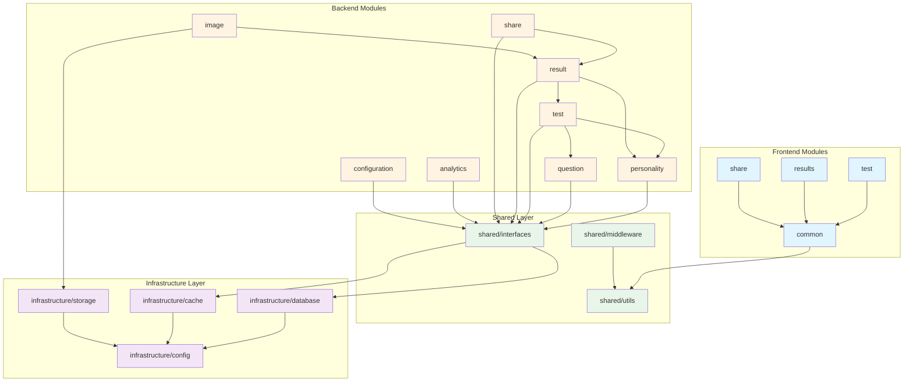

# Internal Module Design

## Document Information
- **Project**: ChickPersonality
- **Based on**: Data Structure (Step 5), Function List (Step 7), Architecture Summary (Step 12)
- **Architecture Type**: Monolith
- **Technology Stack**: TypeScript (React + Node.js/Express)
- **Version**: 1.0
- **Last Updated**: 2026-05-27

---

## 1. Module Breakdown

### Project Structure

```
chickpersonality/
├── frontend/                          # React Application
│   ├── src/
│   │   ├── modules/
│   │   │   ├── test/
│   │   │   │   ├── components/
│   │   │   │   ├── hooks/
│   │   │   │   ├── services/
│   │   │   │   ├── store/
│   │   │   │   └── types/
│   │   │   ├── results/
│   │   │   │   ├── components/
│   │   │   │   ├── hooks/
│   │   │   │   ├── services/
│   │   │   │   └── types/
│   │   │   ├── share/
│   │   │   │   ├── components/
│   │   │   │   ├── hooks/
│   │   │   │   ├── services/
│   │   │   │   └── types/
│   │   │   └── common/
│   │   │       ├── components/
│   │   │       ├── hooks/
│   │   │       ├── utils/
│   │   │       └── types/
│   │   ├── shared/
│   │   │   ├── api/
│   │   │   ├── storage/
│   │   │   ├── analytics/
│   │   │   └── validation/
│   │   └── infrastructure/
│   │       ├── config/
│   │       └── constants/
│   └── public/
├── backend/                           # Express.js / Serverless API
│   ├── src/
│   │   ├── modules/
│   │   │   ├── personality/
│   │   │   │   ├── personality.service.ts
│   │   │   │   ├── personality.controller.ts
│   │   │   │   ├── personality.repository.ts
│   │   │   │   └── interfaces/
│   │   │   │       ├── IPersonalityService.ts
│   │   │   │       └── IPersonalityRepository.ts
│   │   │   ├── question/
│   │   │   │   ├── question.service.ts
│   │   │   │   ├── question.controller.ts
│   │   │   │   ├── question.repository.ts
│   │   │   │   └── interfaces/
│   │   │   │       ├── IQuestionService.ts
│   │   │   │       └── IQuestionRepository.ts
│   │   │   ├── test/
│   │   │   │   ├── test.service.ts
│   │   │   │   ├── test.controller.ts
│   │   │   │   ├── test.repository.ts
│   │   │   │   ├── scoring.service.ts
│   │   │   │   └── interfaces/
│   │   │   │       ├── ITestService.ts
│   │   │   │       ├── ITestRepository.ts
│   │   │   │       └── IScoringService.ts
│   │   │   ├── result/
│   │   │   │   ├── result.service.ts
│   │   │   │   ├── result.controller.ts
│   │   │   │   ├── result.repository.ts
│   │   │   │   └── interfaces/
│   │   │   │       ├── IResultService.ts
│   │   │   │       └── IResultRepository.ts
│   │   │   ├── share/
│   │   │   │   ├── share.service.ts
│   │   │   │   ├── share.controller.ts
│   │   │   │   ├── share.repository.ts
│   │   │   │   └── interfaces/
│   │   │   │       ├── IShareService.ts
│   │   │   │       └── IShareRepository.ts
│   │   │   ├── analytics/
│   │   │   │   ├── analytics.service.ts
│   │   │   │   ├── analytics.controller.ts
│   │   │   │   ├── analytics.repository.ts
│   │   │   │   └── interfaces/
│   │   │   │       ├── IAnalyticsService.ts
│   │   │   │       └── IAnalyticsRepository.ts
│   │   │   ├── configuration/
│   │   │   │   ├── configuration.service.ts
│   │   │   │   ├── configuration.controller.ts
│   │   │   │   ├── configuration.repository.ts
│   │   │   │   └── interfaces/
│   │   │   │       ├── IConfigurationService.ts
│   │   │   │       └── IConfigurationRepository.ts
│   │   │   └── image/
│   │   │       ├── image.service.ts
│   │   │       ├── image.controller.ts
│   │   │       └── interfaces/
│   │   │           └── IImageService.ts
│   │   ├── shared/
│   │   │   ├── interfaces/
│   │   │   │   ├── IRepository.ts
│   │   │   │   ├── IService.ts
│   │   │   │   ├── ICache.ts
│   │   │   │   └── IDatabase.ts
│   │   │   ├── utils/
│   │   │   │   ├── validators.ts
│   │   │   │   ├── sanitizers.ts
│   │   │   │   ├── hash.ts
│   │   │   │   └── uuid.ts
│   │   │   ├── middleware/
│   │   │   │   ├── errorHandler.ts
│   │   │   │   ├── rateLimiter.ts
│   │   │   │   ├── requestLogger.ts
│   │   │   │   └── validator.ts
│   │   │   └── types/
│   │   │       ├── dto.ts
│   │   │       ├── entities.ts
│   │   │       └── errors.ts
│   │   └── infrastructure/
│   │       ├── database/
│   │       │   ├── connection.ts
│   │       │   ├── migrations/
│   │       │   └── seeds/
│   │       ├── cache/
│   │       │   ├── redis.ts
│   │       │   └── cache.ts
│   │       ├── storage/
│   │       │   ├── s3.ts
│   │       │   └── storage.ts
│   │       └── config/
│   │           ├── env.ts
│   │           └── constants.ts
│   └── tests/
│       ├── unit/
│       ├── integration/
│       └── e2e/
└── docs/
```

---

## 2. Module Dependencies

### Dependency Graph



### Module Dependency Matrix

| Module | Depends On | Reason |
|--------|------------|--------|
| **test (frontend)** | common | Reuses common components and utilities |
| **results (frontend)** | common | Reuses common components and utilities |
| **share (frontend)** | common | Reuses common components and utilities |
| **common (frontend)** | - | Base module, no dependencies |
| **personality (backend)** | shared/interfaces | Uses base repository and service interfaces |
| **question (backend)** | shared/interfaces | Uses base repository and service interfaces |
| **test (backend)** | question, personality, shared/interfaces | Needs questions for test, personality for scoring |
| **result (backend)** | test, personality, shared/interfaces | Created by test completion, needs personality details |
| **share (backend)** | result, shared/interfaces | Creates share links for results |
| **analytics (backend)** | shared/interfaces | Independent module for event tracking |
| **configuration (backend)** | shared/interfaces | Independent module for app configuration |
| **image (backend)** | result, storage | Generates images for results, uses object storage |
| **shared/interfaces** | database, cache | Base interfaces for data access and caching |
| **shared/utils** | - | Utility functions, no dependencies |
| **shared/middleware** | shared/utils | Uses utilities for validation and error handling |
| **infrastructure/database** | config | Needs configuration for connection |
| **infrastructure/cache** | config | Needs configuration for connection |
| **infrastructure/storage** | config | Needs configuration for S3/Cloudinary |
| **infrastructure/config** | - | Configuration loader, no dependencies |

---

## 3. Module Interfaces

### 3.1 Shared Interfaces

#### IRepository (Base Repository Interface)

```typescript
// src/backend/shared/interfaces/IRepository.ts

import { PaginationParams, PaginatedResult } from '../types/dto';

/**
 * Base repository interface defining common CRUD operations
 * All domain repositories must extend this interface
 */
export interface IRepository<T, CreateDTO, UpdateDTO> {
  /**
   * Create a new entity
   * @param data - Data for creating the entity
   * @returns Created entity
   */
  create(data: CreateDTO): Promise<T>;

  /**
   * Find entity by ID
   * @param id - Entity UUID
   * @returns Entity or null if not found
   */
  findById(id: string): Promise<T | null>;

  /**
   * Find all entities matching filter
   * @param filter - Optional filter criteria
   * @param pagination - Optional pagination parameters
   * @returns Array of entities
   */
  findMany(
    filter?: Record<string, any>,
    pagination?: PaginationParams
  ): Promise<T[]>;

  /**
   * Find entities with pagination
   * @param filter - Optional filter criteria
   * @param pagination - Pagination parameters
   * @returns Paginated result with metadata
   */
  findManyPaginated(
    filter?: Record<string, any>,
    pagination?: PaginationParams
  ): Promise<PaginatedResult<T>>;

  /**
   * Update entity by ID
   * @param id - Entity UUID
   * @param data - Data for updating the entity
   * @returns Updated entity
   */
  update(id: string, data: UpdateDTO): Promise<T>;

  /**
   * Delete entity by ID
   * @param id - Entity UUID
   * @returns void
   */
  delete(id: string): Promise<void>;

  /**
   * Count entities matching filter
   * @param filter - Optional filter criteria
   * @returns Count of entities
   */
  count(filter?: Record<string, any>): Promise<number>;

  /**
   * Check if entity exists
   * @param id - Entity UUID
   * @returns true if entity exists, false otherwise
   */
  exists(id: string): Promise<boolean>;
}
```

#### IService (Base Service Interface)

```typescript
// src/backend/shared/interfaces/IService.ts

import { PaginationParams, PaginatedResult } from '../types/dto';

/**
 * Base service interface defining common business operations
 * All domain services must extend this interface
 */
export interface IService<T, CreateDTO, UpdateDTO> {
  /**
   * Create a new entity with business logic
   * @param data - Data for creating the entity
   * @returns Created entity
   */
  create(data: CreateDTO): Promise<T>;

  /**
   * Get entity by ID with business logic
   * @param id - Entity UUID
   * @returns Entity or null if not found
   */
  getById(id: string): Promise<T | null>;

  /**
   * Get all entities with business logic
   * @param filter - Optional filter criteria
   * @param pagination - Optional pagination parameters
   * @returns Array of entities
   */
  getMany(
    filter?: Record<string, any>,
    pagination?: PaginationParams
  ): Promise<T[]>;

  /**
   * Get entities with pagination and business logic
   * @param filter - Optional filter criteria
   * @param pagination - Pagination parameters
   * @returns Paginated result with metadata
   */
  getManyPaginated(
    filter?: Record<string, any>,
    pagination?: PaginationParams
  ): Promise<PaginatedResult<T>>;

  /**
   * Update entity with business logic
   * @param id - Entity UUID
   * @param data - Data for updating the entity
   * @returns Updated entity
   */
  update(id: string, data: UpdateDTO): Promise<T>;

  /**
   * Delete entity with business logic
   * @param id - Entity UUID
   * @returns void
   */
  delete(id: string): Promise<void>;
}
```

#### ICache (Cache Interface)

```typescript
// src/backend/shared/interfaces/ICache.ts

/**
 * Cache interface for caching operations
 * Implemented by Redis cache
 */
export interface ICache {
  /**
   * Get value from cache
   * @param key - Cache key
   * @returns Cached value or null if not found
   */
  get<T>(key: string): Promise<T | null>;

  /**
   * Set value in cache
   * @param key - Cache key
   * @param value - Value to cache
   * @param ttlSeconds - Time to live in seconds (optional)
   * @returns void
   */
  set<T>(key: string, value: T, ttlSeconds?: number): Promise<void>;

  /**
   * Delete value from cache
   * @param key - Cache key
   * @returns void
   */
  delete(key: string): Promise<void>;

  /**
   * Check if key exists in cache
   * @param key - Cache key
   * @returns true if key exists, false otherwise
   */
  exists(key: string): Promise<boolean>;

  /**
   * Clear all cache entries matching pattern
   * @param pattern - Key pattern (e.g., "user:*")
   * @returns void
   */
  clearPattern(pattern: string): Promise<void>;

  /**
   * Increment a counter in cache
   * @param key - Cache key
   * @param amount - Amount to increment (default: 1)
   * @returns New counter value
   */
  increment(key: string, amount?: number): Promise<number>;
}
```

#### IDatabase (Database Interface)

```typescript
// src/backend/shared/interfaces/IDatabase.ts

/**
 * Database interface for database operations
 * Implemented by PostgreSQL connection
 */
export interface IDatabase {
  /**
   * Execute a query
   * @param query - SQL query string
   * @param params - Query parameters
   * @returns Query result
   */
  query<T>(query: string, params?: any[]): Promise<T>;

  /**
   * Execute a transaction
   * @param callback - Transaction callback function
   * @returns Transaction result
   */
  transaction<T>(callback: (client: any) => Promise<T>): Promise<T>;

  /**
   * Get database connection
   * @returns Database client
   */
  getConnection(): any;

  /**
   * Close database connection
   * @returns void
   */
  close(): Promise<void>;

  /**
   * Check database health
   * @returns true if healthy, false otherwise
   */
  healthCheck(): Promise<boolean>;
}
```

---

### 3.2 Personality Module Interfaces

#### IPersonalityRepository

```typescript
// src/backend/modules/personality/interfaces/IPersonalityRepository.ts

import { IRepository } from '../../../shared/interfaces/IRepository';
import {
  PersonalityType,
  CreatePersonalityTypeDTO,
  UpdatePersonalityTypeDTO,
} from '../../../shared/types/entities';

/**
 * Personality type repository interface
 * Handles data access for personality types
 */
export interface IPersonalityRepository
  extends IRepository<
    PersonalityType,
    CreatePersonalityTypeDTO,
    UpdatePersonalityTypeDTO
  > {
  /**
   * Find personality type by slug
   * @param slug - Personality type slug
   * @returns Personality type or null if not found
   */
  findBySlug(slug: string): Promise<PersonalityType | null>;

  /**
   * Get all active personality types ordered by priority
   * @returns Array of active personality types
   */
  findActiveOrdered(): Promise<PersonalityType[]>;

  /**
   * Get personality type by priority order
   * @param priorityOrder - Priority order (1-7)
   * @returns Personality type or null if not found
   */
  findByPriorityOrder(priorityOrder: number): Promise<PersonalityType | null>;

  /**
   * Check if personality type slug exists
   * @param slug - Personality type slug
   * @returns true if exists, false otherwise
   */
  existsBySlug(slug: string): Promise<boolean>;

  /**
   * Count active personality types
   * @returns Count of active personality types
   */
  countActive(): Promise<number>;
}
```

#### IPersonalityService

```typescript
// src/backend/modules/personality/interfaces/IPersonalityService.ts

import { IService } from '../../../shared/interfaces/IService';
import {
  PersonalityType,
  CreatePersonalityTypeDTO,
  UpdatePersonalityTypeDTO,
  PersonalityTypeResponseDTO,
  PersonalityTypeListDTO,
} from '../../../shared/types/entities';

/**
 * Personality type service interface
 * Handles business logic for personality types
 */
export interface IPersonalityService
  extends IService<
    PersonalityType,
    CreatePersonalityTypeDTO,
    UpdatePersonalityTypeDTO
  > {
  /**
   * Get personality type by slug
   * @param slug - Personality type slug
   * @returns Personality type response DTO or null if not found
   */
  getBySlug(slug: string): Promise<PersonalityTypeResponseDTO | null>;

  /**
   * Get all active personality types ordered by priority
   * @returns Array of personality type response DTOs
   */
  getActiveOrdered(): Promise<PersonalityTypeResponseDTO[]>;

  /**
   * Get personality type by priority order
   * @param priorityOrder - Priority order (1-7)
   * @returns Personality type response DTO or null if not found
   */
  getByPriorityOrder(
    priorityOrder: number
  ): Promise<PersonalityTypeResponseDTO | null>;

  /**
   * Validate personality type data
   * @param data - Personality type data
   * @returns Validation result with errors if any
   */
  validate(data: CreatePersonalityTypeDTO | UpdatePersonalityTypeDTO): {
    valid: boolean;
    errors: string[];
  };

  /**
   * Activate personality type
   * @param id - Personality type UUID
   * @returns Updated personality type
   */
  activate(id: string): Promise<PersonalityType>;

  /**
   * Deactivate personality type
   * @param id - Personality type UUID
   * @returns Updated personality type
   */
  deactivate(id: string): Promise<PersonalityType>;
}
```

---

### 3.3 Question Module Interfaces

#### IQuestionRepository

```typescript
// src/backend/modules/question/interfaces/IQuestionRepository.ts

import { IRepository } from '../../../shared/interfaces/IRepository';
import {
  Question,
  CreateQuestionDTO,
  UpdateQuestionDTO,
  AnswerOption,
} from '../../../shared/types/entities';

/**
 * Question repository interface
 * Handles data access for questions
 */
export interface IQuestionRepository
  extends IRepository<Question, CreateQuestionDTO, UpdateQuestionDTO> {
  /**
   * Find question by question number
   * @param questionNumber - Question number (1-30)
   * @returns Question or null if not found
   */
  findByQuestionNumber(questionNumber: number): Promise<Question | null>;

  /**
   * Get all active questions ordered by question number
   * @returns Array of active questions
   */
  findActiveOrdered(): Promise<Question[]>;

  /**
   * Get question with answer options
   * @param id - Question UUID
   * @returns Question with answer options or null if not found
   */
  findWithOptions(id: string): Promise<(Question & { answer_options: AnswerOption[] }) | null>;

  /**
   * Get all active questions with answer options ordered by question number
   * @returns Array of questions with answer options
   */
  findActiveOrderedWithOptions(): Promise<
    (Question & { answer_options: AnswerOption[] })[]
  >;

  /**
   * Get questions by category
   * @param category - Category name
   * @returns Array of questions
   */
  findByCategory(category: string): Promise<Question[]>;

  /**
   * Check if question number exists
   * @param questionNumber - Question number (1-30)
   * @returns true if exists, false otherwise
   */
  existsByQuestionNumber(questionNumber: number): Promise<boolean>;

  /**
   * Count active questions
   * @returns Count of active questions
   */
  countActive(): Promise<number>;
}
```

#### IQuestionService

```typescript
// src/backend/modules/question/interfaces/IQuestionService.ts

import { IService } from '../../../shared/interfaces/IService';
import {
  Question,
  CreateQuestionDTO,
  UpdateQuestionDTO,
  QuestionResponseDTO,
  QuestionWithOptionsDTO,
} from '../../../shared/types/entities';

/**
 * Question service interface
 * Handles business logic for questions
 */
export interface IQuestionService
  extends IService<Question, CreateQuestionDTO, UpdateQuestionDTO> {
  /**
   * Get question by question number
   * @param questionNumber - Question number (1-30)
   * @returns Question response DTO or null if not found
   */
  getByQuestionNumber(questionNumber: number): Promise<QuestionResponseDTO | null>;

  /**
   * Get all active questions ordered by question number
   * @returns Array of question response DTOs
   */
  getActiveOrdered(): Promise<QuestionResponseDTO[]>;

  /**
   * Get all active questions with answer options ordered by question number
   * @returns Array of question with options DTOs
   */
  getActiveOrderedWithOptions(): Promise<QuestionWithOptionsDTO[]>;

  /**
   * Get question with answer options
   * @param id - Question UUID
   * @returns Question with options DTO or null if not found
   */
  getWithOptions(id: string): Promise<QuestionWithOptionsDTO | null>;

  /**
   * Validate question data
   * @param data - Question data
   * @returns Validation result with errors if any
   */
  validate(data: CreateQuestionDTO | UpdateQuestionDTO): {
    valid: boolean;
    errors: string[];
  };

  /**
   * Activate question
   * @param id - Question UUID
   * @returns Updated question
   */
  activate(id: string): Promise<Question>;

  /**
   * Deactivate question
   * @param id - Question UUID
   * @returns Updated question
   */
  deactivate(id: string): Promise<Question>;
}
```

---

### 3.4 Test Module Interfaces

#### ITestRepository

```typescript
// src/backend/modules/test/interfaces/ITestRepository.ts

import { IRepository } from '../../../shared/interfaces/IRepository';
import {
  TestResult,
  CreateTestResultDTO,
  TestAnswer,
  BulkCreateTestAnswersDTO,
} from '../../../shared/types/entities';

/**
 * Test repository interface
 * Handles data access for test results and answers
 */
export interface ITestRepository extends IRepository<TestResult, CreateTestResultDTO, any> {
  /**
   * Find test result by share token
   * @param shareToken - Share token (32 characters)
   * @returns Test result or null if not found
   */
  findByShareToken(shareToken: string): Promise<TestResult | null>;

  /**
   * Create test result with answers in a transaction
   * @param testResult - Test result data
   * @param answers - Array of test answers
   * @returns Created test result
   */
  createWithAnswers(
    testResult: CreateTestResultDTO,
    answers: BulkCreateTestAnswersDTO
  ): Promise<TestResult>;

  /**
   * Get test result with answers
   * @param id - Test result UUID
   * @returns Test result with answers or null if not found
   */
  findWithAnswers(id: string): Promise<(TestResult & { answers: TestAnswer[] }) | null>;

  /**
   * Get test result by share token with answers
   * @param shareToken - Share token (32 characters)
   * @returns Test result with answers or null if not found
   */
  findByShareTokenWithAnswers(
    shareToken: string
  ): Promise<(TestResult & { answers: TestAnswer[] }) | null>;

  /**
   * Check if share token exists
   * @param shareToken - Share token (32 characters)
   * @returns true if exists, false otherwise
   */
  existsByShareToken(shareToken: string): Promise<boolean>;

  /**
   * Get test results by personality type
   * @param personalityId - Personality type UUID
   * @param startDate - Start date for filtering
   * @param endDate - End date for filtering
   * @returns Array of test results
   */
  findByPersonalityType(
    personalityId: string,
    startDate?: Date,
    endDate?: Date
  ): Promise<TestResult[]>;

  /**
   * Count test results by personality type
   * @param personalityId - Personality type UUID
   * @param startDate - Start date for filtering
   * @param endDate - End date for filtering
   * @returns Count of test results
   */
  countByPersonalityType(
    personalityId: string,
    startDate?: Date,
    endDate?: Date
  ): Promise<number>;
}
```

#### IScoringService

```typescript
// src/backend/modules/test/interfaces/IScoringService.ts

import {
  ScoreBreakdown,
  PersonalityTypeSlug,
  ScoringWeights,
} from '../../../shared/types/entities';

/**
 * Scoring service interface
 * Handles personality score calculation logic
 */
export interface IScoringService {
  /**
   * Calculate personality scores from answers
   * @param answers - Array of answer option IDs with scoring weights
   * @returns Score breakdown with percentages and raw scores
   */
  calculateScores(answers: Array<{ scoring_weights: ScoringWeights }>): ScoreBreakdown;

  /**
   * Determine primary personality type from score breakdown
   * @param scoreBreakdown - Score breakdown
   * @param priorityOrder - Priority order for tie-breaking
   * @returns Primary personality type slug
   */
  determinePrimaryPersonality(
    scoreBreakdown: ScoreBreakdown,
    priorityOrder: PersonalityTypeSlug[]
  ): PersonalityTypeSlug;

  /**
   * Determine secondary personality types from score breakdown
   * @param scoreBreakdown - Score breakdown
   * @param primarySlug - Primary personality type slug
   * @param threshold - Percentage threshold for secondary types (default: 10)
   * @returns Array of secondary personality type slugs
   */
  determineSecondaryPersonalities(
    scoreBreakdown: ScoreBreakdown,
    primarySlug: PersonalityTypeSlug,
    threshold?: number
  ): PersonalityTypeSlug[];

  /**
   * Normalize raw scores to percentages
   * @param rawScores - Raw score values per personality type
   * @returns Normalized percentages (sum to 100%)
   */
  normalizeScores(rawScores: Record<PersonalityTypeSlug, number>): ScoreBreakdown;

  /**
   * Validate score breakdown
   * @param scoreBreakdown - Score breakdown to validate
   * @returns Validation result with errors if any
   */
  validateScoreBreakdown(scoreBreakdown: ScoreBreakdown): {
    valid: boolean;
    errors: string[];
  };
}
```

#### ITestService

```typescript
// src/backend/modules/test/interfaces/ITestService.ts

import { IService } from '../../../shared/interfaces/IService';
import {
  TestResult,
  CreateTestResultDTO,
  TestResultResponseDTO,
  TestResultPublicDTO,
  BulkCreateTestAnswersDTO,
  DeviceType,
} from '../../../shared/types/entities';

/**
 * Test service interface
 * Handles business logic for test taking and result generation
 */
export interface ITestService extends IService<TestResult, CreateTestResultDTO, any> {
  /**
   * Start a new test session
   * @param deviceType - Device type (mobile, tablet, desktop)
   * @param userAgent - User agent string (optional)
   * @param ipAddressHash - Hashed IP address (optional)
   * @returns Test session ID
   */
  startTest(
    deviceType: DeviceType,
    userAgent?: string,
    ipAddressHash?: string
  ): Promise<{ sessionId: string }>;

  /**
   * Submit answer for a question
   * @param sessionId - Test session ID
   * @param questionId - Question UUID
   * @param answerOptionId - Answer option UUID
   * @returns Success confirmation
   */
  submitAnswer(
    sessionId: string,
    questionId: string,
    answerOptionId: string
  ): Promise<{ success: boolean }>;

  /**
   * Complete test and calculate results
   * @param sessionId - Test session ID
   * @param answers - Array of answers
   * @param totalTimeSeconds - Total time taken in seconds
   * @returns Test result response DTO
   */
  finishTest(
    sessionId: string,
    answers: BulkCreateTestAnswersDTO,
    totalTimeSeconds: number
  ): Promise<TestResultResponseDTO>;

  /**
   * Get test result by share token
   * @param shareToken - Share token (32 characters)
   * @returns Test result public DTO or null if not found
   */
  getResultByShareToken(shareToken: string): Promise<TestResultPublicDTO | null>;

  /**
   * Resume test from saved progress
   * @param sessionId - Test session ID
   * @returns Test session state with answered questions
   */
  resumeTest(sessionId: string): Promise<{
    sessionId: string;
    answeredQuestions: Array<{ questionId: string; answerOptionId: string }>;
    currentQuestionNumber: number;
  }>;

  /**
   * Clear test session
   * @param sessionId - Test session ID
   * @returns void
   */
  clearTest(sessionId: string): Promise<void>;
}
```

---

### 3.5 Result Module Interfaces

#### IResultRepository

```typescript
// src/backend/modules/result/interfaces/IResultRepository.ts

import { IRepository } from '../../../shared/interfaces/IRepository';
import {
  TestResult,
  CreateTestResultDTO,
} from '../../../shared/types/entities';

/**
 * Result repository interface
 * Handles data access for test results
 * (Note: This is a separate module from Test for result retrieval and analytics)
 */
export interface IResultRepository
  extends IRepository<TestResult, CreateTestResultDTO, any> {
  /**
   * Find test result by share token
   * @param shareToken - Share token (32 characters)
   * @returns Test result or null if not found
   */
  findByShareToken(shareToken: string): Promise<TestResult | null>;

  /**
   * Get test result with personality details
   * @param shareToken - Share token (32 characters)
   * @returns Test result with personality type or null if not found
   */
  findByShareTokenWithPersonality(
    shareToken: string
  ): Promise<(TestResult & { personality_type: any }) | null>;

  /**
   * Get test results by date range
   * @param startDate - Start date
   * @param endDate - End date
   * @returns Array of test results
   */
  findByDateRange(startDate: Date, endDate: Date): Promise<TestResult[]>;

  /**
   * Get test results by device type
   * @param deviceType - Device type (mobile, tablet, desktop)
   * @param startDate - Start date (optional)
   * @param endDate - End date (optional)
   * @returns Array of test results
   */
  findByDeviceType(
    deviceType: string,
    startDate?: Date,
    endDate?: Date
  ): Promise<TestResult[]>;

  /**
   * Archive old test results
   * @param daysThreshold - Days threshold for archival (default: 90)
   * @returns Number of archived results
   */
  archiveOldResults(daysThreshold?: number): Promise<number>;

  /**
   * Delete archived test results
   * @param daysThreshold - Days threshold for deletion (default: 180)
   * @returns Number of deleted results
   */
  deleteArchivedResults(daysThreshold?: number): Promise<number>;
}
```

#### IResultService

```typescript
// src/backend/modules/result/interfaces/IResultService.ts

import { IService } from '../../../shared/interfaces/IService';
import {
  TestResultResponseDTO,
  TestResultPublicDTO,
} from '../../../shared/types/entities';

/**
 * Result service interface
 * Handles business logic for result retrieval and analytics
 */
export interface IResultService {
  /**
   * Get test result by share token
   * @param shareToken - Share token (32 characters)
   * @returns Test result response DTO or null if not found
   */
  getResultByShareToken(shareToken: string): Promise<TestResultResponseDTO | null>;

  /**
   * Get public test result by share token (for sharing)
   * @param shareToken - Share token (32 characters)
   * @returns Test result public DTO or null if not found
   */
  getPublicResultByShareToken(shareToken: string): Promise<TestResultPublicDTO | null>;

  /**
   * Get result analytics
   * @param startDate - Start date
   * @param endDate - End date
   * @returns Analytics data
   */
  getResultAnalytics(startDate: Date, endDate: Date): Promise<{
    totalResults: number;
    byPersonalityType: Record<string, number>;
    byDeviceType: Record<string, number>;
    averageCompletionTime: number;
  }>;

  /**
   * Archive old results
   * @param daysThreshold - Days threshold for archival (default: 90)
   * @returns Number of archived results
   */
  archiveOldResults(daysThreshold?: number): Promise<number>;

  /**
   * Delete archived results
   * @param daysThreshold - Days threshold for deletion (default: 180)
   * @returns Number of deleted results
   */
  deleteArchivedResults(daysThreshold?: number): Promise<number>;
}
```

---

### 3.6 Share Module Interfaces

#### IShareRepository

```typescript
// src/backend/modules/share/interfaces/IShareRepository.ts

import { IRepository } from '../../../shared/interfaces/IRepository';
import {
  ShareLink,
  CreateShareLinkDTO,
} from '../../../shared/types/entities';

/**
 * Share link repository interface
 * Handles data access for share links
 */
export interface IShareRepository
  extends IRepository<ShareLink, CreateShareLinkDTO, any> {
  /**
   * Find share link by share token
   * @param shareToken - Share token (32 characters)
   * @returns Share link or null if not found
   */
  findByShareToken(shareToken: string): Promise<ShareLink | null>;

  /**
   * Find share link by test result ID
   * @param testResultId - Test result UUID
   * @returns Share link or null if not found
   */
  findByTestResultId(testResultId: string): Promise<ShareLink | null>;

  /**
   * Increment share link click count
   * @param shareToken - Share token (32 characters)
   * @returns Updated click count
   */
  incrementClickCount(shareToken: string): Promise<number>;

  /**
   * Delete expired share links
   * @returns Number of deleted links
   */
  deleteExpired(): Promise<number>;

  /**
   * Check if share link is expired
   * @param shareToken - Share token (32 characters)
   * @returns true if expired, false otherwise
   */
  isExpired(shareToken: string): Promise<boolean>;

  /**
   * Get share link with test result
   * @param shareToken - Share token (32 characters)
   * @returns Share link with test result or null if not found
   */
  findWithTestResult(
    shareToken: string
  ): Promise<(ShareLink & { test_result: any }) | null>;
}
```

#### IShareService

```typescript
// src/backend/modules/share/interfaces/IShareService.ts

import {
  ShareLinkResponseDTO,
  CreateShareLinkDTO,
} from '../../../shared/types/entities';

/**
 * Share service interface
 * Handles business logic for share links
 */
export interface IShareService {
  /**
   * Create share link for test result
   * @param testResultId - Test result UUID
   * @returns Share link response DTO
   */
  createShareLink(testResultId: string): Promise<ShareLinkResponseDTO>;

  /**
   * Get share link by share token
   * @param shareToken - Share token (32 characters)
   * @returns Share link response DTO or null if not found
   */
  getShareLink(shareToken: string): Promise<ShareLinkResponseDTO | null>;

  /**
   * Validate share link (check if not expired)
   * @param shareToken - Share token (32 characters)
   * @returns Validation result
   */
  validateShareLink(shareToken: string): Promise<{
    valid: boolean;
    expired: boolean;
    shareLink?: ShareLinkResponseDTO;
  }>;

  /**
   * Track share link click
   * @param shareToken - Share token (32 characters)
   * @returns Updated click count
   */
  trackClick(shareToken: string): Promise<number>;

  /**
   * Delete expired share links
   * @returns Number of deleted links
   */
  deleteExpired(): Promise<number>;

  /**
   * Generate share URL
   * @param shareToken - Share token (32 characters)
   * @returns Full share URL
   */
  generateShareUrl(shareToken: string): string;
}
```

---

### 3.7 Analytics Module Interfaces

#### IAnalyticsRepository

```typescript
// src/backend/modules/analytics/interfaces/IAnalyticsRepository.ts

import { IRepository } from '../../../shared/interfaces/IRepository';
import {
  AnalyticsEvent,
  CreateAnalyticsEventDTO,
  EventType,
  PersonalityTypeSlug,
  DeviceType,
} from '../../../shared/types/entities';

/**
 * Analytics event repository interface
 * Handles data access for analytics events
 */
export interface IAnalyticsRepository
  extends IRepository<AnalyticsEvent, CreateAnalyticsEventDTO, any> {
  /**
   * Get analytics events by event type
   * @param eventType - Event type
   * @param startDate - Start date (optional)
   * @param endDate - End date (optional)
   * @returns Array of analytics events
   */
  findByEventType(
    eventType: EventType,
    startDate?: Date,
    endDate?: Date
  ): Promise<AnalyticsEvent[]>;

  /**
   * Get analytics events by session
   * @param sessionId - Session ID (64 characters)
   * @returns Array of analytics events
   */
  findBySession(sessionId: string): Promise<AnalyticsEvent[]>;

  /**
   * Get analytics events by personality type
   * @param personalityTypeSlug - Personality type slug
   * @param startDate - Start date (optional)
   * @param endDate - End date (optional)
   * @returns Array of analytics events
   */
  findByPersonalityType(
    personalityTypeSlug: PersonalityTypeSlug,
    startDate?: Date,
    endDate?: Date
  ): Promise<AnalyticsEvent[]>;

  /**
   * Get analytics events by device type
   * @param deviceType - Device type
   * @param startDate - Start date (optional)
   * @param endDate - End date (optional)
   * @returns Array of analytics events
   */
  findByDeviceType(
    deviceType: DeviceType,
    startDate?: Date,
    endDate?: Date
  ): Promise<AnalyticsEvent[]>;

  /**
   * Count analytics events by event type
   * @param eventType - Event type
   * @param startDate - Start date (optional)
   * @param endDate - End date (optional)
   * @returns Count of events
   */
  countByEventType(
    eventType: EventType,
    startDate?: Date,
    endDate?: Date
  ): Promise<number>;

  /**
   * Aggregate analytics by event type
   * @param startDate - Start date
   * @param endDate - End date
   * @returns Aggregated data
   */
  aggregateByEventType(startDate: Date, endDate: Date): Promise<
    Record<EventType, number>
  >;

  /**
   * Aggregate analytics by personality type
   * @param startDate - Start date
   * @param endDate - End date
   * @returns Aggregated data
   */
  aggregateByPersonalityType(
    startDate: Date,
    endDate: Date
  ): Promise<Record<PersonalityTypeSlug, number>>;

  /**
   * Aggregate analytics by device type
   * @param startDate - Start date
   * @param endDate - End date
   * @returns Aggregated data
   */
  aggregateByDeviceType(
    startDate: Date,
    endDate: Date
  ): Promise<Record<DeviceType, number>>;

  /**
   * Delete old analytics events
   * @param daysThreshold - Days threshold for deletion (default: 365)
   * @returns Number of deleted events
   */
  deleteOldEvents(daysThreshold?: number): Promise<number>;
}
```

#### IAnalyticsService

```typescript
// src/backend/modules/analytics/interfaces/IAnalyticsService.ts

import {
  CreateAnalyticsEventDTO,
  AnalyticsAggregationDTO,
} from '../../../shared/types/entities';

/**
 * Analytics service interface
 * Handles business logic for analytics tracking and reporting
 */
export interface IAnalyticsService {
  /**
   * Log analytics event
   * @param event - Analytics event data
   * @returns void
   */
  logEvent(event: CreateAnalyticsEventDTO): Promise<void>;

  /**
   * Log analytics events in batch
   * @param events - Array of analytics events
   * @returns void
   */
  logEventsBatch(events: CreateAnalyticsEventDTO[]): Promise<void>;

  /**
   * Get analytics aggregation by event type
   * @param startDate - Start date
   * @param endDate - End date
   * @returns Analytics aggregation DTO
   */
  getAggregationByEventType(
    startDate: Date,
    endDate: Date
  ): Promise<AnalyticsAggregationDTO>;

  /**
   * Get analytics aggregation by personality type
   * @param startDate - Start date
   * @param endDate - End date
   * @returns Aggregated data
   */
  getAggregationByPersonalityType(
    startDate: Date,
    endDate: Date
  ): Promise<Record<string, number>>;

  /**
   * Get analytics aggregation by device type
   * @param startDate - Start date
   * @param endDate - End date
   * @returns Aggregated data
   */
  getAggregationByDeviceType(
    startDate: Date,
    endDate: Date
  ): Promise<Record<string, number>>;

  /**
   * Get session analytics
   * @param sessionId - Session ID (64 characters)
   * @returns Session analytics data
   */
  getSessionAnalytics(sessionId: string): Promise<{
    sessionId: string;
    events: CreateAnalyticsEventDTO[];
    eventCount: number;
    firstEventAt: Date;
    lastEventAt: Date;
  }>;

  /**
   * Delete old analytics events
   * @param daysThreshold - Days threshold for deletion (default: 365)
   * @returns Number of deleted events
   */
  deleteOldEvents(daysThreshold?: number): Promise<number>;

  /**
   * Sanitize analytics event data (remove PII)
   * @param event - Analytics event data
   * @returns Sanitized event data
   */
  sanitizeEvent(event: CreateAnalyticsEventDTO): CreateAnalyticsEventDTO;
}
```

---

### 3.8 Configuration Module Interfaces

#### IConfigurationRepository

```typescript
// src/backend/modules/configuration/interfaces/IConfigurationRepository.ts

import { IRepository } from '../../../shared/interfaces/IRepository';
import {
  Configuration,
  CreateConfigurationDTO,
  UpdateConfigurationDTO,
} from '../../../shared/types/entities';

/**
 * Configuration repository interface
 * Handles data access for application configuration
 */
export interface IConfigurationRepository
  extends IRepository<
    Configuration,
    CreateConfigurationDTO,
    UpdateConfigurationDTO
  > {
  /**
   * Find configuration by key
   * @param configKey - Configuration key
   * @returns Configuration or null if not found
   */
  findByKey(configKey: string): Promise<Configuration | null>;

  /**
   * Get all public configurations
   * @returns Array of public configurations
   */
  findPublic(): Promise<Configuration[]>;

  /**
   * Get public configurations as key-value map
   * @returns Map of configuration keys to values
   */
  findPublicAsMap(): Promise<Record<string, string>>;

  /**
   * Check if configuration key exists
   * @param configKey - Configuration key
   * @returns true if exists, false otherwise
   */
  existsByKey(configKey: string): Promise<boolean>;

  /**
   * Get configuration value by key
   * @param configKey - Configuration key
   * @returns Configuration value or null if not found
   */
  getValueByKey(configKey: string): Promise<string | null>;

  /**
   * Set configuration value by key (upsert)
   * @param configKey - Configuration key
   * @param configValue - Configuration value
   * @returns Updated configuration
   */
  setValueByKey(configKey: string, configValue: string): Promise<Configuration>;
}
```

#### IConfigurationService

```typescript
// src/backend/modules/configuration/interfaces/IConfigurationService.ts

import {
  ConfigurationResponseDTO,
  PublicConfigurationDTO,
  CreateConfigurationDTO,
  UpdateConfigurationDTO,
} from '../../../shared/types/entities';

/**
 * Configuration service interface
 * Handles business logic for application configuration
 */
export interface IConfigurationService {
  /**
   * Get configuration by key
   * @param configKey - Configuration key
   * @returns Configuration response DTO or null if not found
   */
  getByKey(configKey: string): Promise<ConfigurationResponseDTO | null>;

  /**
   * Get all public configurations
   * @returns Array of public configuration DTOs
   */
  getPublic(): Promise<PublicConfigurationDTO[]>;

  /**
   * Get public configurations as key-value map
   * @returns Map of configuration keys to values
   */
  getPublicAsMap(): Promise<Record<string, string>>;

  /**
   * Get configuration value by key
   * @param configKey - Configuration key
   * @returns Configuration value or null if not found
   */
  getValueByKey(configKey: string): Promise<string | null>;

  /**
   * Create configuration
   * @param data - Configuration data
   * @returns Created configuration response DTO
   */
  create(data: CreateConfigurationDTO): Promise<ConfigurationResponseDTO>;

  /**
   * Update configuration by key
   * @param configKey - Configuration key
   * @param data - Configuration update data
   * @returns Updated configuration response DTO
   */
  updateByKey(
    configKey: string,
    data: UpdateConfigurationDTO
  ): Promise<ConfigurationResponseDTO>;

  /**
   * Delete configuration by key
   * @param configKey - Configuration key
   * @returns void
   */
  deleteByKey(configKey: string): Promise<void>;

  /**
   * Validate configuration data
   * @param data - Configuration data
   * @returns Validation result with errors if any
   */
  validate(data: CreateConfigurationDTO | UpdateConfigurationDTO): {
    valid: boolean;
    errors: string[];
  };

  /**
   * Reload configuration (clear cache)
   * @returns void
   */
  reload(): Promise<void>;
}
```

---

### 3.9 Image Module Interfaces

#### IImageService

```typescript
// src/backend/modules/image/interfaces/IImageService.ts

/**
 * Image service interface
 * Handles business logic for image generation
 */
export interface IImageService {
  /**
   * Generate shareable image card for test result
   * @param shareToken - Share token (32 characters)
   * @returns Generated image URL
   */
  generateShareCard(shareToken: string): Promise<string>;

  /**
   * Generate personality type icon
   * @param personalitySlug - Personality type slug
   * @returns Generated icon URL
   */
  generatePersonalityIcon(personalitySlug: string): Promise<string>;

  /**
   * Generate custom image with text overlay
   * @param text - Text to overlay
   * @param backgroundColor - Background color (HEX)
   * @param textColor - Text color (HEX)
   * @returns Generated image URL
   */
  generateCustomImage(
    text: string,
    backgroundColor: string,
    textColor: string
  ): Promise<string>;

  /**
   * Optimize image for web
   * @param imageUrl - Image URL
   * @returns Optimized image URL
   */
  optimizeImage(imageUrl: string): Promise<string>;

  /**
   * Delete image from storage
   * @param imageUrl - Image URL
   * @returns void
   */
  deleteImage(imageUrl: string): Promise<void>;

  /**
   * Validate image URL
   * @param imageUrl - Image URL
   * @returns Validation result
   */
  validateImageUrl(imageUrl: string): {
    valid: boolean;
    error?: string;
  };
}
```

---

## 4. Frontend Module Structure

### 4.1 Test Module (Frontend)

```
frontend/src/modules/test/
├── components/
│   ├── QuestionCard.tsx
│   ├── AnswerOption.tsx
│   ├── ProgressBar.tsx
│   ├── NavigationButtons.tsx
│   └── TestContainer.tsx
├── hooks/
│   ├── useTestSession.ts
│   ├── useQuestionNavigation.ts
│   ├── useAnswerSelection.ts
│   └── useTestProgress.ts
├── services/
│   ├── testApi.ts
│   └── testStorage.ts
├── store/
│   ├── testStore.ts
│   └── testSelectors.ts
└── types/
    ├── TestSession.ts
    ├── QuestionState.ts
    └── AnswerState.ts
```

### 4.2 Results Module (Frontend)

```
frontend/src/modules/results/
├── components/
│   ├── PersonalityHeader.tsx
│   ├── TraitsSection.tsx
│   ├── StrengthsSection.tsx
│   ├── WeaknessesSection.tsx
│   ├── CompatibilitySection.tsx
│   ├── ScoreBreakdown.tsx
│   └── ResultsContainer.tsx
├── hooks/
│   ├── useResults.ts
│   ├── usePersonalityTheme.ts
│   └── useShareableImage.ts
├── services/
│   ├── resultsApi.ts
│   └── imageGeneration.ts
└── types/
    ├── ResultData.ts
    └── PersonalityDisplay.ts
```

### 4.3 Share Module (Frontend)

```
frontend/src/modules/share/
├── components/
│   ├── ShareButtons.tsx
│   ├── CopyLinkButton.tsx
│   ├── CopyTextButton.tsx
│   ├── SocialShareDialog.tsx
│   └── ShareContainer.tsx
├── hooks/
│   ├── useSocialShare.ts
│   ├── useClipboard.ts
│   └── useShareTracking.ts
├── services/
│   ├── shareApi.ts
│   └── socialMedia.ts
└── types/
    ├── ShareContent.ts
    └── SharePlatform.ts
```

### 4.4 Common Module (Frontend)

```
frontend/src/modules/common/
├── components/
│   ├── Button.tsx
│   ├── Card.tsx
│   ├── LoadingSpinner.tsx
│   ├── ErrorMessage.tsx
│   ├── SuccessMessage.tsx
│   └── Layout.tsx
├── hooks/
│   ├── useDeviceType.ts
│   ├── useLocalStorage.ts
│   ├── useKeyboardNavigation.ts
│   └── useScreenReader.ts
├── utils/
│   ├── validators.ts
│   ├── formatters.ts
│   └── accessibility.ts
└── types/
    ├── DeviceType.ts
    └── Accessibility.ts
```

---

## 5. Shared Layer

### 5.1 Shared API (Frontend)

```
frontend/src/shared/api/
├── client.ts                    # HTTP client with interceptors
├── endpoints.ts                 # API endpoint definitions
├── interceptors/
│   ├── authInterceptor.ts       # Authentication interceptor (Phase 2)
│   ├── errorInterceptor.ts      # Error handling interceptor
│   └── loggingInterceptor.ts    # Request logging interceptor
└── types/
    └── ApiResponse.ts           # API response types
```

### 5.2 Shared Storage (Frontend)

```
frontend/src/shared/storage/
├── localStorage.ts              # Local storage wrapper
├── sessionStorage.ts             # Session storage wrapper
├── storageKeys.ts               # Storage key constants
└── types/
    └── StorageData.ts           # Storage data types
```

### 5.3 Shared Analytics (Frontend)

```
frontend/src/shared/analytics/
├── analytics.ts                 # Analytics client
├── events.ts                    # Event definitions
├── session.ts                   # Session management
└── types/
    └── AnalyticsEvent.ts        # Analytics event types
```

### 5.4 Shared Validation (Frontend)

```
frontend/src/shared/validation/
├── validators.ts                # Validation functions
├── schemas.ts                   # Validation schemas
└── types/
    └── ValidationResult.ts      # Validation result types
```

---

## 6. Infrastructure Layer

### 6.1 Database

```
backend/src/infrastructure/database/
├── connection.ts                 # PostgreSQL connection pool
├── migrations/                  # Database migration files
│   ├── V1__create_initial_schema.sql
│   ├── V2__create_audit_log_table.sql
│   └── ...
├── seeds/                       # Seed data files
│   ├── personality_types.sql
│   ├── questions.sql
│   └── answer_options.sql
└── client.ts                    # Database client wrapper
```

### 6.2 Cache

```
backend/src/infrastructure/cache/
├── redis.ts                     # Redis client
├── cache.ts                     # Cache wrapper implementing ICache
├── cacheKeys.ts                 # Cache key constants
└── config.ts                    # Cache configuration
```

### 6.3 Storage

```
backend/src/infrastructure/storage/
├── s3.ts                        # AWS S3 client
├── cloudinary.ts                # Cloudinary client (alternative)
├── storage.ts                   # Storage wrapper
└── config.ts                    # Storage configuration
```

### 6.4 Config

```
backend/src/infrastructure/config/
├── env.ts                       # Environment variables loader
├── constants.ts                 # Application constants
├── database.ts                  # Database configuration
├── cache.ts                     # Cache configuration
└── storage.ts                   # Storage configuration
```

---

## 7. Module Communication Patterns

### 7.1 Synchronous Communication

**Service → Repository:**
- Direct method calls within the same module
- Transaction management for multi-step operations
- Error propagation with custom error types

**Service → Service:**
- Direct method calls for related modules
- Example: TestService calls PersonalityService for scoring
- Example: ShareService calls ResultService for result retrieval

**Controller → Service:**
- Direct method calls from API controllers
- Request/response DTO transformation
- Error handling and HTTP status code mapping

### 7.2 Asynchronous Communication

**Analytics Event Logging:**
- Fire-and-forget pattern
- Queue events locally if analytics service unavailable
- Batch events before sending

**Image Generation:**
- Async processing with timeout
- Fallback to alternative sharing methods if timeout
- Polling or webhook for completion notification

### 7.3 Cache Communication

**Read-Through Cache:**
- Service checks cache first
- Cache miss → Repository query → Cache set
- Cache hit → Return cached data

**Write-Through Cache:**
- Service writes to repository
- Service invalidates related cache entries
- Cache updated on next read

**Cache Invalidation:**
- Manual invalidation on configuration updates
- TTL-based expiration for all cached data
- Pattern-based invalidation for bulk operations

---

## 8. Error Handling Strategy

### 8.1 Error Types

```typescript
// src/backend/shared/types/errors.ts

export class AppError extends Error {
  constructor(
    public statusCode: number,
    public message: string,
    public code: string,
    public details?: Record<string, any>
  ) {
    super(message);
    this.name = this.constructor.name;
    Error.captureStackTrace(this, this.constructor);
  }
}

export class ValidationError extends AppError {
  constructor(message: string, details?: Record<string, any>) {
    super(400, message, 'VALIDATION_ERROR', details);
  }
}

export class NotFoundError extends AppError {
  constructor(resource: string, id: string) {
    super(404, `${resource} with id ${id} not found`, 'NOT_FOUND', { resource, id });
  }
}

export class ConflictError extends AppError {
  constructor(message: string, details?: Record<string, any>) {
    super(409, message, 'CONFLICT_ERROR', details);
  }
}

export class DatabaseError extends AppError {
  constructor(message: string, details?: Record<string, any>) {
    super(500, message, 'DATABASE_ERROR', details);
  }
}

export class CacheError extends AppError {
  constructor(message: string, details?: Record<string, any>) {
    super(500, message, 'CACHE_ERROR', details);
  }
}

export class ExternalServiceError extends AppError {
  constructor(service: string, message: string) {
    super(502, `External service ${service} error: ${message}`, 'EXTERNAL_SERVICE_ERROR', { service });
  }
}
```

### 8.2 Error Handling Middleware

```typescript
// src/backend/shared/middleware/errorHandler.ts

import { Request, Response, NextFunction } from 'express';
import { AppError } from '../types/errors';

export function errorHandler(
  err: Error,
  req: Request,
  res: Response,
  next: NextFunction
): void {
  if (err instanceof AppError) {
    res.status(err.statusCode).json({
      error: err.code,
      message: err.message,
      details: err.details,
      timestamp: new Date().toISOString(),
    });
  } else {
    // Unexpected error
    console.error('Unexpected error:', err);
    res.status(500).json({
      error: 'INTERNAL_SERVER_ERROR',
      message: 'An unexpected error occurred',
      timestamp: new Date().toISOString(),
    });
  }
}
```

---

## 9. Dependency Injection

### 9.1 Service Container

```typescript
// src/backend/infrastructure/di/container.ts

import { Container } from 'inversify';
import { TYPES } from './types';
import { IPersonalityService } from '../../modules/personality/interfaces/IPersonalityService';
import { PersonalityService } from '../../modules/personality/personality.service';
import { IPersonalityRepository } from '../../modules/personality/interfaces/IPersonalityRepository';
import { PersonalityRepository } from '../../modules/personality/personality.repository';
// ... other imports

const container = new Container();

// Bind repositories
container.bind<IPersonalityRepository>(TYPES.IPersonalityRepository).to(PersonalityRepository);
container.bind<IQuestionRepository>(TYPES.IQuestionRepository).to(QuestionRepository);
// ... other repository bindings

// Bind services
container.bind<IPersonalityService>(TYPES.IPersonalityService).to(PersonalityService);
container.bind<IQuestionService>(TYPES.IQuestionService).to(QuestionService);
// ... other service bindings

// Bind infrastructure
container.bind<ICache>(TYPES.ICache).to(RedisCache);
container.bind<IDatabase>(TYPES.IDatabase).to(PostgresDatabase);
// ... other infrastructure bindings

export default container;
```

### 9.2 Dependency Types

```typescript
// src/backend/infrastructure/di/types.ts

export const TYPES = {
  // Repositories
  IPersonalityRepository: Symbol.for('IPersonalityRepository'),
  IQuestionRepository: Symbol.for('IQuestionRepository'),
  ITestRepository: Symbol.for('ITestRepository'),
  IResultRepository: Symbol.for('IResultRepository'),
  IShareRepository: Symbol.for('IShareRepository'),
  IAnalyticsRepository: Symbol.for('IAnalyticsRepository'),
  IConfigurationRepository: Symbol.for('IConfigurationRepository'),

  // Services
  IPersonalityService: Symbol.for('IPersonalityService'),
  IQuestionService: Symbol.for('IQuestionService'),
  ITestService: Symbol.for('ITestService'),
  IScoringService: Symbol.for('IScoringService'),
  IResultService: Symbol.for('IResultService'),
  IShareService: Symbol.for('IShareService'),
  IAnalyticsService: Symbol.for('IAnalyticsService'),
  IConfigurationService: Symbol.for('IConfigurationService'),
  IImageService: Symbol.for('IImageService'),

  // Infrastructure
  ICache: Symbol.for('ICache'),
  IDatabase: Symbol.for('IDatabase'),
  IStorage: Symbol.for('IStorage'),
};
```

---

## 10. Testing Strategy

### 10.1 Unit Tests

**Repository Tests:**
- Mock database connection
- Test CRUD operations
- Test custom query methods
- Test error handling

**Service Tests:**
- Mock repositories
- Test business logic
- Test validation
- Test error handling

**Component Tests (Frontend):**
- Test component rendering
- Test user interactions
- Test state management
- Test accessibility

### 10.2 Integration Tests

**API Tests:**
- Test API endpoints
- Test request/response flow
- Test error handling
- Test rate limiting

**Database Tests:**
- Test repository with real database
- Test transactions
- Test constraints
- Test migrations

### 10.3 E2E Tests

**User Flow Tests:**
- Test complete test-taking flow
- Test result sharing flow
- Test error recovery
- Test cross-browser compatibility

---

## 11. Module Evolution Path

### Phase 1 (Current)
- Monolithic architecture
- All modules in single codebase
- Shared database and cache
- Direct module communication

### Phase 2 (Future)
- Introduce user authentication module
- Add admin dashboard module
- Enhance analytics module with real-time features
- Add content management module

### Phase 3 (Future - If Needed)
- Extract image generation as separate service
- Extract analytics as separate service
- Consider microservices migration if team grows
- Implement API gateway for service routing

---

**Document Version**: 1.0  
**Last Updated**: 2026-05-27  
**Status**: Draft - Ready for Review  
**Next Step**: Proceed to `/aspec-14-api-design` - Generate API Design (Step 14)
